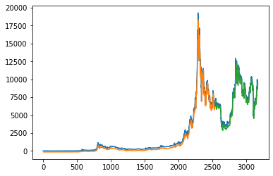
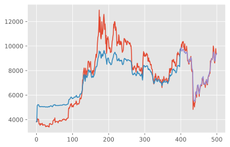

# RNN Neural Network


```python
import os
import numpy 
import pandas as pd
import matplotlib.pylab as plt
import seaborn as sns
from statsmodels.graphics.tsaplots import plot_acf, plot_pacf
from statsmodels.tsa.stattools import adfuller
from sklearn.metrics import mean_squared_error
import helper_functions as hf

import statsmodels.api as sm
import statsmodels.tsa.api as smt

CURDIR = os.path.dirname(os.getcwd())
DATADIR = os.path.join(CURDIR,  "data")
%matplotlib inline

from sklearn.preprocessing import MinMaxScaler
plt.style.use("ggplot")

from keras.models import Sequential
from keras.layers import LSTM, Dense, Dropout

```


```python
# Importing data

dataframe = pd.read_csv(os.path.join(DATADIR, "df_blockchain.csv"), delimiter=";")
dataframe["Date"] = pd.to_datetime(dataframe["Date"], format="%Y/%m/%d")
```

## 1) 1-step forecast


```python
dataset = dataframe[["Date","market-price"]]
dataset.set_index("Date",inplace=True)
#dataset = dataset.tail(500)

# Convert an array of values into a dataset matrix
def create_dataset(dataset, look_back=1):
    dataX, dataY = [], []
    for i in range(len(dataset)-look_back-1):
        a = dataset[i:(i+look_back), 0]
        dataX.append(a)
        dataY.append(dataset[i + look_back, 0])
        
    return numpy.array(dataX), numpy.array(dataY)

# Normalize the dataset
scaler = MinMaxScaler(feature_range=(0, 1))
dataset = scaler.fit_transform(dataset)

# Split into train and test sets
train_size = int(len(dataset) * 0.8)
test_size = len(dataset) - train_size
train, test = dataset[0:train_size,:], dataset[train_size:len(dataset),:]

# Reshape into X=t and Y=t+1
look_back = 10
trainX, trainY = create_dataset(train, look_back)
testX, testY = create_dataset(test, look_back)

# Reshape input to be [samples, time steps, features]
trainX = numpy.reshape(trainX, (trainX.shape[0], 1, trainX.shape[1]))
testX = numpy.reshape(testX, (testX.shape[0], 1, testX.shape[1]))
```


```python
# Create and fit the LSTM network
model = Sequential()
model.add(LSTM(4, input_shape=(1, look_back)))
model.add(Dense(1))
model.compile(loss='mean_squared_error', optimizer='adam')
model.fit(trainX, trainY, epochs=10, batch_size=1, verbose=2)
```

    Epoch 1/10


    ---------------------------------------------------------------------------

    KeyboardInterrupt                         Traceback (most recent call last)

    <ipython-input-19-e413f40d1372> in <module>
          4 model.add(Dense(1))
          5 model.compile(loss='mean_squared_error', optimizer='adam')
    ----> 6 model.fit(trainX, trainY, epochs=10, batch_size=1, verbose=2)
    

    ~/anaconda3/lib/python3.7/site-packages/keras/engine/training.py in fit(self, x, y, batch_size, epochs, verbose, callbacks, validation_split, validation_data, shuffle, class_weight, sample_weight, initial_epoch, steps_per_epoch, validation_steps, validation_freq, max_queue_size, workers, use_multiprocessing, **kwargs)
       1237                                         steps_per_epoch=steps_per_epoch,
       1238                                         validation_steps=validation_steps,
    -> 1239                                         validation_freq=validation_freq)
       1240 
       1241     def evaluate(self,


    ~/anaconda3/lib/python3.7/site-packages/keras/engine/training_arrays.py in fit_loop(model, fit_function, fit_inputs, out_labels, batch_size, epochs, verbose, callbacks, val_function, val_inputs, shuffle, initial_epoch, steps_per_epoch, validation_steps, validation_freq)
        194                     ins_batch[i] = ins_batch[i].toarray()
        195 
    --> 196                 outs = fit_function(ins_batch)
        197                 outs = to_list(outs)
        198                 for l, o in zip(out_labels, outs):


    ~/anaconda3/lib/python3.7/site-packages/tensorflow/python/keras/backend.py in __call__(self, inputs)
       3784               'You must feed a value for placeholder %s' % (tensor,))
       3785       if not isinstance(value, ops.Tensor):
    -> 3786         value = ops.convert_to_tensor_v2(value, dtype=tensor.dtype)
       3787       if value.dtype != tensor.dtype:
       3788         # Temporary workaround due to `convert_to_tensor` not casting floats.


    ~/anaconda3/lib/python3.7/site-packages/tensorflow/python/framework/ops.py in convert_to_tensor_v2(value, dtype, dtype_hint, name)
       1281       name=name,
       1282       preferred_dtype=dtype_hint,
    -> 1283       as_ref=False)
       1284 
       1285 


    ~/anaconda3/lib/python3.7/site-packages/tensorflow/python/framework/ops.py in convert_to_tensor(value, dtype, name, as_ref, preferred_dtype, dtype_hint, ctx, accepted_result_types)
       1339 
       1340     if ret is None:
    -> 1341       ret = conversion_func(value, dtype=dtype, name=name, as_ref=as_ref)
       1342 
       1343     if ret is NotImplemented:


    ~/anaconda3/lib/python3.7/site-packages/tensorflow/python/framework/tensor_conversion_registry.py in _default_conversion_function(***failed resolving arguments***)
         50 def _default_conversion_function(value, dtype, name, as_ref):
         51   del as_ref  # Unused.
    ---> 52   return constant_op.constant(value, dtype, name=name)
         53 
         54 


    ~/anaconda3/lib/python3.7/site-packages/tensorflow/python/framework/constant_op.py in constant(value, dtype, shape, name)
        260   """
        261   return _constant_impl(value, dtype, shape, name, verify_shape=False,
    --> 262                         allow_broadcast=True)
        263 
        264 


    ~/anaconda3/lib/python3.7/site-packages/tensorflow/python/framework/constant_op.py in _constant_impl(value, dtype, shape, name, verify_shape, allow_broadcast)
        268   ctx = context.context()
        269   if ctx.executing_eagerly():
    --> 270     t = convert_to_eager_tensor(value, ctx, dtype)
        271     if shape is None:
        272       return t


    ~/anaconda3/lib/python3.7/site-packages/tensorflow/python/framework/constant_op.py in convert_to_eager_tensor(value, ctx, dtype)
         94       dtype = dtypes.as_dtype(dtype).as_datatype_enum
         95   ctx.ensure_initialized()
    ---> 96   return ops.EagerTensor(value, ctx.device_name, dtype)
         97 
         98 


    KeyboardInterrupt: 


```python
# Make predictions
trainPredict = model.predict(trainX)
testPredict = model.predict(testX)

# Invert predictions
trainPredict = scaler.inverse_transform(trainPredict)
trainY = scaler.inverse_transform([trainY])
testPredict = scaler.inverse_transform(testPredict)
testY = scaler.inverse_transform([testY])
```


```python
# Calculate root mean squared error
trainScore = math.sqrt(mean_squared_error(trainY[0], trainPredict[:,0]))
print('Train Score: %.2f RMSE' % (trainScore))
testScore = math.sqrt(mean_squared_error(testY[0], testPredict[:,0]))
print('Test Score: %.2f RMSE' % (testScore))

# Shift train predictions for plotting
trainPredictPlot = numpy.empty_like(dataset)
trainPredictPlot[:, :] = numpy.nan
trainPredictPlot[look_back:len(trainPredict)+look_back, :] = trainPredict

# Shift test predictions for plotting
testPredictPlot = numpy.empty_like(dataset)
testPredictPlot[:, :] = numpy.nan
testPredictPlot[len(trainPredict)+(look_back*2)+1:len(dataset)-1, :] = testPredict

# Plot baseline and predictions
plt.plot(scaler.inverse_transform(dataset))
plt.plot(trainPredictPlot)
plt.plot(testPredictPlot)
plt.show()
```

    Train Score: 359.16 RMSE
    Test Score: 514.94 RMSE





## 2) Variable steps forecast


```python
# Split a univariate sequence into samples
def split_sequence(sequence, n_steps_in, n_steps_out):
    X, y = list(), list()
    for i in range(len(sequence)):
        # Find the end of this pattern
        end_ix = i + n_steps_in
        out_end_ix = end_ix + n_steps_out
        # Check if we are beyond the sequence
        if out_end_ix > len(sequence):
            break
        # Gather input and output parts of the pattern
        seq_x, seq_y = sequence[i:end_ix], sequence[end_ix:out_end_ix]
        X.append(seq_x)
        y.append(seq_y)
    return numpy.array(X), numpy.array(y)
```


```python
# Define input sequence
dataset = dataframe[["Date","market-price"]]
dataset.set_index("Date",inplace=True)
#dataset = dataset.tail(500)

# Normalize the dataset
scaler = MinMaxScaler(feature_range=(0, 1))
dataset = scaler.fit_transform(dataset)

# Split into train and test sets
train_size = int(len(dataset) * 0.8)
test_size = len(dataset) - train_size
train, test = dataset[0:train_size,:], dataset[train_size:len(dataset),:]

# Choose a number of time steps
n_steps_in, n_steps_out = 3, 2
n_features = 1

# Split into samples
trainX, trainY = split_sequence(train, n_steps_in, n_steps_out)
testX, testY = split_sequence(test, n_steps_in, n_steps_out)

trainY = trainY[:, :, 0]
testY = testY[:, :, 0]
```

    2536
    2532


```python
# Define model
model = Sequential()
model.add(LSTM(100, activation='relu', return_sequences=True, input_shape=(n_steps_in, n_features)))
model.add(LSTM(100, activation='relu'))
model.add(Dense(n_steps_out))
model.compile(optimizer='adam', loss='mse')

# Fit model
model.fit(trainX, trainY, batch_size=1, epochs=10, verbose=2)
```

    Epoch 1/10
     - 11s - loss: 0.0021
    Epoch 2/10
     - 10s - loss: 7.7989e-04
    Epoch 3/10
     - 11s - loss: 7.2177e-04
    Epoch 4/10
     - 11s - loss: 5.8043e-04
    Epoch 5/10
     - 12s - loss: 4.6131e-04
    Epoch 6/10
     - 11s - loss: 4.6987e-04
    Epoch 7/10
     - 11s - loss: 4.3190e-04
    Epoch 8/10
     - 11s - loss: 3.8945e-04
    Epoch 9/10
     - 11s - loss: 3.6221e-04
    Epoch 10/10
     - 10s - loss: 3.2651e-04


    <keras.callbacks.callbacks.History at 0x7ff8c6311c10>


```python
import keras.backend as K
import math
```


```python
# Make predictions
trainPredict = model.predict(trainX)
testPredict = model.predict(testX)

# Invert predictions
dataset = scaler.inverse_transform(dataset)
train = scaler.inverse_transform(train)
test = scaler.inverse_transform(test)
trainPredict = scaler.inverse_transform(trainPredict)
trainY = scaler.inverse_transform(trainY)
testPredict = scaler.inverse_transform(testPredict)
testY = scaler.inverse_transform(testY)
```


```python
# Shift train predictions for plotting
trainPredictPlot = [y for x in train[:n_steps_in+n_steps_out-1].tolist() for y in x]
for i in range(n_steps_out-1,len(trainPredict)-n_steps_out+1):
    true_prediction = 0
    for k in range(n_steps_out):
        true_prediction += trainPredict[i+n_steps_out-k-1][k]/n_steps_out
    trainPredictPlot.append(true_prediction)
trainPredictPlot = trainPredictPlot + [y for x in train[len(train)-n_steps_out:].tolist() for y in x]

trainScore = math.sqrt(mean_squared_error(trainPredictPlot, train))
print('Train Score: %.2f RMSE' % (trainScore))

# Shift test predictions for plotting
testPredictPlot = [y for x in test[:n_steps_in+n_steps_out-1].tolist() for y in x]
for i in range(n_steps_out-1,len(testPredict)-n_steps_out+1):
    true_prediction = 0
    for k in range(n_steps_out):
        true_prediction += testPredict[i+n_steps_out-k-1][k]/n_steps_out
    
    testPredictPlot.append(true_prediction)
testPredictPlot = testPredictPlot + [y for x in test[len(test)-n_steps_out:].tolist() for y in x]

trainScore = math.sqrt(mean_squared_error(testPredictPlot, test))
print('Test Score: %.2f RMSE' % (testScore))

# Plot baseline and predictions
plt.plot(dataset)
plt.plot(range(len(train)),trainPredictPlot)
plt.plot([len(train) + i for i in range(len(test))],testPredictPlot)
plt.show()
```


    ---------------------------------------------------------------------------

    ValueError                                Traceback (most recent call last)

    <ipython-input-32-cc48791e9503> in <module>
          8 trainPredictPlot = trainPredictPlot + [y for x in train[len(train)-n_steps_out:].tolist() for y in x]
          9 
    ---> 10 trainScore = math.sqrt(mean_squared_error(trainPredictPlot, train))
         11 print('Train Score: %.2f RMSE' % (trainScore))
         12 


    ~/anaconda3/lib/python3.7/site-packages/sklearn/metrics/regression.py in mean_squared_error(y_true, y_pred, sample_weight, multioutput)
        239     """
        240     y_type, y_true, y_pred, multioutput = _check_reg_targets(
    --> 241         y_true, y_pred, multioutput)
        242     check_consistent_length(y_true, y_pred, sample_weight)
        243     output_errors = np.average((y_true - y_pred) ** 2, axis=0,


    ~/anaconda3/lib/python3.7/site-packages/sklearn/metrics/regression.py in _check_reg_targets(y_true, y_pred, multioutput)
         75 
         76     """
    ---> 77     check_consistent_length(y_true, y_pred)
         78     y_true = check_array(y_true, ensure_2d=False)
         79     y_pred = check_array(y_pred, ensure_2d=False)


    ~/anaconda3/lib/python3.7/site-packages/sklearn/utils/validation.py in check_consistent_length(*arrays)
        203     if len(uniques) > 1:
        204         raise ValueError("Found input variables with inconsistent numbers of"
    --> 205                          " samples: %r" % [int(l) for l in lengths])
        206 
        207 


    ValueError: Found input variables with inconsistent numbers of samples: [404, 400]


## 3) A complete model


```python
# Split a univariate sequence into samples
def split_sequence(sequence, n_steps_in, n_steps_out):
    X, y = list(), list()
    for i in range(len(sequence)):
        # Find the end of this pattern
        end_ix = i + n_steps_in
        out_end_ix = end_ix + n_steps_out
        # Check if we are beyond the sequence
        if out_end_ix > len(sequence):
            break
        # Gather input and output parts of the pattern
        seq_x, seq_y = sequence[i:end_ix], sequence[end_ix:out_end_ix]
        X.append(seq_x)
        y.append(seq_y)
    return numpy.array(X), numpy.array(y)
```


```python
# Define input sequence
dataset = dataframe[["Date","market-price","output-volume"]]
dataset.set_index("Date",inplace=True)
dataset = dataset.tail(500)
dataset = dataset.to_numpy()

# Split into train and test sets
train_size = int(len(dataset) * 0.8)
test_size = len(dataset) - train_size
train, test = dataset[0:train_size,:], dataset[train_size:len(dataset),:]

# Choose a number of time steps
n_steps_in, n_steps_out = 1, 2
n_features = 2

# Split into samples
trainX, trainY = split_sequence(train, n_steps_in, n_steps_out)
testX, testY = split_sequence(test, n_steps_in, n_steps_out)

trainY = trainY[:, :, 0]
testY = testY[:, :, 0]

# Normalize the dataset
scaler_Y = MinMaxScaler()
scalers = {}

for i in range(trainX.shape[1]):
    scalers[i] = MinMaxScaler()
    trainX[:, i, :] = scalers[i].fit_transform(trainX[:, i, :])
    
for i in range(testX.shape[1]):
    scalers[i] = MinMaxScaler()
    testX[:, i, :] = scalers[i].fit_transform(testX[:, i, :])

trainY = scaler_Y.fit_transform(trainY)
testY = scaler_Y.fit_transform(testY)
```


```python
def custom_mse(y_true, y_pred):
    loss = K.square(y_pred - y_true)
    return loss[0]

# Define model
model = Sequential()
model.add(LSTM(n_steps_in, activation="tanh", return_sequences=True, input_shape=(n_steps_in, n_features)))
model.add(LSTM((n_steps_out + n_steps_in)*10, activation="tanh", return_sequences=True))
model.add(Dropout(0.01))
model.add(LSTM(n_steps_out, activation="tanh"))
model.add(Dense(n_steps_out))
model.compile(optimizer='adam', loss=custom_mse)

# Fit model
model.fit(trainX, trainY, batch_size=1, epochs=50, verbose=2)
```

    Epoch 1/50
     - 2s - loss: 0.1079
    Epoch 2/50
     - 1s - loss: 0.0433
    Epoch 3/50
     - 1s - loss: 0.0140
    Epoch 4/50
     - 1s - loss: 0.0026
    Epoch 5/50
     - 1s - loss: 0.0021
    Epoch 6/50
     - 1s - loss: 0.0021
    Epoch 7/50
     - 1s - loss: 0.0021
    Epoch 8/50
     - 1s - loss: 0.0021
    Epoch 9/50
     - 1s - loss: 0.0021
    Epoch 10/50
     - 1s - loss: 0.0021
    Epoch 11/50
     - 1s - loss: 0.0021
    Epoch 12/50
     - 1s - loss: 0.0020
    Epoch 13/50
     - 1s - loss: 0.0020
    Epoch 14/50
     - 1s - loss: 0.0020
    Epoch 15/50
     - 1s - loss: 0.0020
    Epoch 16/50
     - 1s - loss: 0.0020
    Epoch 17/50
     - 1s - loss: 0.0020
    Epoch 18/50
     - 1s - loss: 0.0021
    Epoch 19/50
     - 1s - loss: 0.0020
    Epoch 20/50
     - 1s - loss: 0.0020
    Epoch 21/50
     - 1s - loss: 0.0020
    Epoch 22/50
     - 1s - loss: 0.0021
    Epoch 23/50
     - 1s - loss: 0.0021
    Epoch 24/50
     - 1s - loss: 0.0021
    Epoch 25/50
     - 1s - loss: 0.0021
    Epoch 26/50
     - 1s - loss: 0.0020
    Epoch 27/50
     - 1s - loss: 0.0020
    Epoch 28/50
     - 1s - loss: 0.0021
    Epoch 29/50
     - 1s - loss: 0.0020
    Epoch 30/50
     - 1s - loss: 0.0018
    Epoch 31/50
     - 1s - loss: 0.0019
    Epoch 32/50
     - 1s - loss: 0.0020
    Epoch 33/50
     - 1s - loss: 0.0019
    Epoch 34/50
     - 1s - loss: 0.0019
    Epoch 35/50
     - 1s - loss: 0.0019
    Epoch 36/50
     - 1s - loss: 0.0019
    Epoch 37/50
     - 1s - loss: 0.0019
    Epoch 38/50
     - 1s - loss: 0.0020
    Epoch 39/50
     - 1s - loss: 0.0020
    Epoch 40/50
     - 1s - loss: 0.0019
    Epoch 41/50
     - 1s - loss: 0.0020
    Epoch 42/50
     - 1s - loss: 0.0021
    Epoch 43/50
     - 1s - loss: 0.0019
    Epoch 44/50
     - 1s - loss: 0.0019
    Epoch 45/50
     - 1s - loss: 0.0020
    Epoch 46/50
     - 1s - loss: 0.0019
    Epoch 47/50
     - 1s - loss: 0.0018
    Epoch 48/50
     - 1s - loss: 0.0020
    Epoch 49/50
     - 1s - loss: 0.0019
    Epoch 50/50
     - 1s - loss: 0.0019


    <keras.callbacks.callbacks.History at 0x14f3f4e10>


```python
# Make predictions
trainPredict = model.predict(trainX)
testPredict = model.predict(testX)

# Invert predictionsb
trainPredict = scaler_Y.inverse_transform(trainPredict)
trainY = scaler_Y.inverse_transform(trainY)
testPredict = scaler_Y.inverse_transform(testPredict)
testY = scaler_Y.inverse_transform(testY)
```


```python
# Shift train predictions for plotting
trainPredictPlot = [y[0] for y in train[:n_steps_in+n_steps_out-1]]

for i in range(n_steps_out-1,len(trainPredict)-n_steps_out+1):
    true_prediction = 0
    for k in range(n_steps_out):
        true_prediction += trainPredict[i+n_steps_out-k-1][k]/n_steps_out
    trainPredictPlot.append(true_prediction)

trainPredictPlot = trainPredictPlot + [y[0] for y in train[len(train)-n_steps_out:]]

trainScore = math.sqrt(mean_squared_error(trainPredictPlot, [y[0] for y in train]))
print('Train Score: %.2f RMSE' % (trainScore))

# Shift train predictions for plotting
testPredictPlot = [y[0] for y in test[:n_steps_in+n_steps_out-1]]

for i in range(n_steps_out-1,len(testPredict)-n_steps_out+1):
    true_prediction = 0
    for k in range(n_steps_out):
        true_prediction += testPredict[i+n_steps_out-k-1][k]/n_steps_out
    testPredictPlot.append(true_prediction)

testPredictPlot = testPredictPlot + [y[0] for y in test[len(test)-n_steps_out:]]

testScore = math.sqrt(mean_squared_error(testPredictPlot, [y[0] for y in test]))
print('Test Score: %.2f RMSE' % (testScore))

# Plot baseline and predictions
plt.plot([y[0] for y in dataset])
plt.plot(range(len(train)),trainPredictPlot)
plt.plot([len(train) + i for i in range(len(test))],testPredictPlot)
plt.show()
```

    Train Score: 1132.53 RMSE
    Test Score: 313.23 RMSE





```python

```
