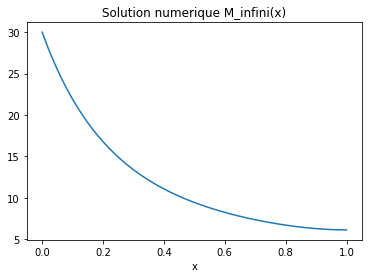

---
categories:
- ""
- ""
date: "2017-10-31T22:42:51-05:00"
description: Nullam et orci eu lorem consequat tincidunt vivamus et sagittis magna
  sed nunc rhoncus condimentum sem. In efficitur ligula tate urna. Maecenas massa
  sed magna lacinia magna pellentesque lorem ipsum dolor. Nullam et orci eu lorem
  consequat tincidunt. Vivamus et sagittis tempus.
draft: false
image: pic07.jpg
keywords: ""
slug: jeffreyk
title: Ipsum
---


# RNN Neural Network


```python
import os
import numpy 
import pandas as pd
import matplotlib.pylab as plt
import seaborn as sns
from statsmodels.graphics.tsaplots import plot_acf, plot_pacf
from statsmodels.tsa.stattools import adfuller
from sklearn.metrics import mean_squared_error
import helper_functions as hf

import statsmodels.api as sm
import statsmodels.tsa.api as smt

CURDIR = os.path.dirname(os.getcwd())
DATADIR = os.path.join(CURDIR,  "data")
%matplotlib inline

from sklearn.preprocessing import MinMaxScaler
plt.style.use("ggplot")

from keras.models import Sequential
from keras.layers import LSTM, Dense, Dropout

```


```python
# Importing data

dataframe = pd.read_csv(os.path.join(DATADIR, "df_blockchain.csv"), delimiter=";")
dataframe["Date"] = pd.to_datetime(dataframe["Date"], format="%Y/%m/%d")
```

## 1) 1-step forecast


```python
dataset = dataframe[["Date","market-price"]]
dataset.set_index("Date",inplace=True)
#dataset = dataset.tail(500)

# Convert an array of values into a dataset matrix
def create_dataset(dataset, look_back=1):
    dataX, dataY = [], []
    for i in range(len(dataset)-look_back-1):
        a = dataset[i:(i+look_back), 0]
        dataX.append(a)
        dataY.append(dataset[i + look_back, 0])
        
    return numpy.array(dataX), numpy.array(dataY)

# Normalize the dataset
scaler = MinMaxScaler(feature_range=(0, 1))
dataset = scaler.fit_transform(dataset)

# Split into train and test sets
train_size = int(len(dataset) * 0.8)
test_size = len(dataset) - train_size
train, test = dataset[0:train_size,:], dataset[train_size:len(dataset),:]

# Reshape into X=t and Y=t+1
look_back = 10
trainX, trainY = create_dataset(train, look_back)
testX, testY = create_dataset(test, look_back)

# Reshape input to be [samples, time steps, features]
trainX = numpy.reshape(trainX, (trainX.shape[0], 1, trainX.shape[1]))
testX = numpy.reshape(testX, (testX.shape[0], 1, testX.shape[1]))
```


```python
# Create and fit the LSTM network
model = Sequential()
model.add(LSTM(4, input_shape=(1, look_back)))
model.add(Dense(1))
model.compile(loss='mean_squared_error', optimizer='adam')
model.fit(trainX, trainY, epochs=10, batch_size=1, verbose=2)
```

    Epoch 1/10


    ---------------------------------------------------------------------------

    KeyboardInterrupt                         Traceback (most recent call last)

    <ipython-input-19-e413f40d1372> in <module>
          4 model.add(Dense(1))
          5 model.compile(loss='mean_squared_error', optimizer='adam')
    ----> 6 model.fit(trainX, trainY, epochs=10, batch_size=1, verbose=2)
    

    ~/anaconda3/lib/python3.7/site-packages/keras/engine/training.py in fit(self, x, y, batch_size, epochs, verbose, callbacks, validation_split, validation_data, shuffle, class_weight, sample_weight, initial_epoch, steps_per_epoch, validation_steps, validation_freq, max_queue_size, workers, use_multiprocessing, **kwargs)
       1237                                         steps_per_epoch=steps_per_epoch,
       1238                                         validation_steps=validation_steps,
    -> 1239                                         validation_freq=validation_freq)
       1240 
       1241     def evaluate(self,


    ~/anaconda3/lib/python3.7/site-packages/keras/engine/training_arrays.py in fit_loop(model, fit_function, fit_inputs, out_labels, batch_size, epochs, verbose, callbacks, val_function, val_inputs, shuffle, initial_epoch, steps_per_epoch, validation_steps, validation_freq)
        194                     ins_batch[i] = ins_batch[i].toarray()
        195 
    --> 196                 outs = fit_function(ins_batch)
        197                 outs = to_list(outs)
        198                 for l, o in zip(out_labels, outs):


    ~/anaconda3/lib/python3.7/site-packages/tensorflow/python/keras/backend.py in __call__(self, inputs)
       3784               'You must feed a value for placeholder %s' % (tensor,))
       3785       if not isinstance(value, ops.Tensor):
    -> 3786         value = ops.convert_to_tensor_v2(value, dtype=tensor.dtype)
       3787       if value.dtype != tensor.dtype:
       3788         # Temporary workaround due to `convert_to_tensor` not casting floats.


    ~/anaconda3/lib/python3.7/site-packages/tensorflow/python/framework/ops.py in convert_to_tensor_v2(value, dtype, dtype_hint, name)
       1281       name=name,
       1282       preferred_dtype=dtype_hint,
    -> 1283       as_ref=False)
       1284 
       1285 


    ~/anaconda3/lib/python3.7/site-packages/tensorflow/python/framework/ops.py in convert_to_tensor(value, dtype, name, as_ref, preferred_dtype, dtype_hint, ctx, accepted_result_types)
       1339 
       1340     if ret is None:
    -> 1341       ret = conversion_func(value, dtype=dtype, name=name, as_ref=as_ref)
       1342 
       1343     if ret is NotImplemented:


    ~/anaconda3/lib/python3.7/site-packages/tensorflow/python/framework/tensor_conversion_registry.py in _default_conversion_function(***failed resolving arguments***)
         50 def _default_conversion_function(value, dtype, name, as_ref):
         51   del as_ref  # Unused.
    ---> 52   return constant_op.constant(value, dtype, name=name)
         53 
         54 


    ~/anaconda3/lib/python3.7/site-packages/tensorflow/python/framework/constant_op.py in constant(value, dtype, shape, name)
        260   """
        261   return _constant_impl(value, dtype, shape, name, verify_shape=False,
    --> 262                         allow_broadcast=True)
        263 
        264 


    ~/anaconda3/lib/python3.7/site-packages/tensorflow/python/framework/constant_op.py in _constant_impl(value, dtype, shape, name, verify_shape, allow_broadcast)
        268   ctx = context.context()
        269   if ctx.executing_eagerly():
    --> 270     t = convert_to_eager_tensor(value, ctx, dtype)
        271     if shape is None:
        272       return t


    ~/anaconda3/lib/python3.7/site-packages/tensorflow/python/framework/constant_op.py in convert_to_eager_tensor(value, ctx, dtype)
         94       dtype = dtypes.as_dtype(dtype).as_datatype_enum
         95   ctx.ensure_initialized()
    ---> 96   return ops.EagerTensor(value, ctx.device_name, dtype)
         97 
         98 


    KeyboardInterrupt: 


```python
# Make predictions
trainPredict = model.predict(trainX)
testPredict = model.predict(testX)

# Invert predictions
trainPredict = scaler.inverse_transform(trainPredict)
trainY = scaler.inverse_transform([trainY])
testPredict = scaler.inverse_transform(testPredict)
testY = scaler.inverse_transform([testY])
```


```python
# Calculate root mean squared error
trainScore = math.sqrt(mean_squared_error(trainY[0], trainPredict[:,0]))
print('Train Score: %.2f RMSE' % (trainScore))
testScore = math.sqrt(mean_squared_error(testY[0], testPredict[:,0]))
print('Test Score: %.2f RMSE' % (testScore))

# Shift train predictions for plotting
trainPredictPlot = numpy.empty_like(dataset)
trainPredictPlot[:, :] = numpy.nan
trainPredictPlot[look_back:len(trainPredict)+look_back, :] = trainPredict

# Shift test predictions for plotting
testPredictPlot = numpy.empty_like(dataset)
testPredictPlot[:, :] = numpy.nan
testPredictPlot[len(trainPredict)+(look_back*2)+1:len(dataset)-1, :] = testPredict

# Plot baseline and predictions
plt.plot(scaler.inverse_transform(dataset))
plt.plot(trainPredictPlot)
plt.plot(testPredictPlot)
plt.show()
```

    Train Score: 359.16 RMSE
    Test Score: 514.94 RMSE


## 2) Variable steps forecast


```python
# Split a univariate sequence into samples
def split_sequence(sequence, n_steps_in, n_steps_out):
    X, y = list(), list()
    for i in range(len(sequence)):
        # Find the end of this pattern
        end_ix = i + n_steps_in
        out_end_ix = end_ix + n_steps_out
        # Check if we are beyond the sequence
        if out_end_ix > len(sequence):
            break
        # Gather input and output parts of the pattern
        seq_x, seq_y = sequence[i:end_ix], sequence[end_ix:out_end_ix]
        X.append(seq_x)
        y.append(seq_y)
    return numpy.array(X), numpy.array(y)
```


```python
# Define input sequence
dataset = dataframe[["Date","market-price"]]
dataset.set_index("Date",inplace=True)
#dataset = dataset.tail(500)

# Normalize the dataset
scaler = MinMaxScaler(feature_range=(0, 1))
dataset = scaler.fit_transform(dataset)

# Split into train and test sets
train_size = int(len(dataset) * 0.8)
test_size = len(dataset) - train_size
train, test = dataset[0:train_size,:], dataset[train_size:len(dataset),:]

# Choose a number of time steps
n_steps_in, n_steps_out = 3, 2
n_features = 1

# Split into samples
trainX, trainY = split_sequence(train, n_steps_in, n_steps_out)
testX, testY = split_sequence(test, n_steps_in, n_steps_out)

trainY = trainY[:, :, 0]
testY = testY[:, :, 0]
```

    2536
    2532


```python
# Define model
model = Sequential()
model.add(LSTM(100, activation='relu', return_sequences=True, input_shape=(n_steps_in, n_features)))
model.add(LSTM(100, activation='relu'))
model.add(Dense(n_steps_out))
model.compile(optimizer='adam', loss='mse')

# Fit model
model.fit(trainX, trainY, batch_size=1, epochs=10, verbose=2)
```

    Epoch 1/10
     - 11s - loss: 0.0021
    Epoch 2/10
     - 10s - loss: 7.7989e-04
    Epoch 3/10
     - 11s - loss: 7.2177e-04
    Epoch 4/10
     - 11s - loss: 5.8043e-04
    Epoch 5/10
     - 12s - loss: 4.6131e-04
    Epoch 6/10
     - 11s - loss: 4.6987e-04
    Epoch 7/10
     - 11s - loss: 4.3190e-04
    Epoch 8/10
     - 11s - loss: 3.8945e-04
    Epoch 9/10
     - 11s - loss: 3.6221e-04
    Epoch 10/10
     - 10s - loss: 3.2651e-04


    <keras.callbacks.callbacks.History at 0x7ff8c6311c10>


```python
import keras.backend as K
import math
```


```python
# Make predictions
trainPredict = model.predict(trainX)
testPredict = model.predict(testX)

# Invert predictions
dataset = scaler.inverse_transform(dataset)
train = scaler.inverse_transform(train)
test = scaler.inverse_transform(test)
trainPredict = scaler.inverse_transform(trainPredict)
trainY = scaler.inverse_transform(trainY)
testPredict = scaler.inverse_transform(testPredict)
testY = scaler.inverse_transform(testY)
```


```python
# Shift train predictions for plotting
trainPredictPlot = [y for x in train[:n_steps_in+n_steps_out-1].tolist() for y in x]
for i in range(n_steps_out-1,len(trainPredict)-n_steps_out+1):
    true_prediction = 0
    for k in range(n_steps_out):
        true_prediction += trainPredict[i+n_steps_out-k-1][k]/n_steps_out
    trainPredictPlot.append(true_prediction)
trainPredictPlot = trainPredictPlot + [y for x in train[len(train)-n_steps_out:].tolist() for y in x]

trainScore = math.sqrt(mean_squared_error(trainPredictPlot, train))
print('Train Score: %.2f RMSE' % (trainScore))

# Shift test predictions for plotting
testPredictPlot = [y for x in test[:n_steps_in+n_steps_out-1].tolist() for y in x]
for i in range(n_steps_out-1,len(testPredict)-n_steps_out+1):
    true_prediction = 0
    for k in range(n_steps_out):
        true_prediction += testPredict[i+n_steps_out-k-1][k]/n_steps_out
    
    testPredictPlot.append(true_prediction)
testPredictPlot = testPredictPlot + [y for x in test[len(test)-n_steps_out:].tolist() for y in x]

trainScore = math.sqrt(mean_squared_error(testPredictPlot, test))
print('Test Score: %.2f RMSE' % (testScore))

# Plot baseline and predictions
plt.plot(dataset)
plt.plot(range(len(train)),trainPredictPlot)
plt.plot([len(train) + i for i in range(len(test))],testPredictPlot)
plt.show()
```


    ---------------------------------------------------------------------------

    ValueError                                Traceback (most recent call last)

    <ipython-input-32-cc48791e9503> in <module>
          8 trainPredictPlot = trainPredictPlot + [y for x in train[len(train)-n_steps_out:].tolist() for y in x]
          9 
    ---> 10 trainScore = math.sqrt(mean_squared_error(trainPredictPlot, train))
         11 print('Train Score: %.2f RMSE' % (trainScore))
         12 


    ~/anaconda3/lib/python3.7/site-packages/sklearn/metrics/regression.py in mean_squared_error(y_true, y_pred, sample_weight, multioutput)
        239     """
        240     y_type, y_true, y_pred, multioutput = _check_reg_targets(
    --> 241         y_true, y_pred, multioutput)
        242     check_consistent_length(y_true, y_pred, sample_weight)
        243     output_errors = np.average((y_true - y_pred) ** 2, axis=0,


    ~/anaconda3/lib/python3.7/site-packages/sklearn/metrics/regression.py in _check_reg_targets(y_true, y_pred, multioutput)
         75 
         76     """
    ---> 77     check_consistent_length(y_true, y_pred)
         78     y_true = check_array(y_true, ensure_2d=False)
         79     y_pred = check_array(y_pred, ensure_2d=False)


    ~/anaconda3/lib/python3.7/site-packages/sklearn/utils/validation.py in check_consistent_length(*arrays)
        203     if len(uniques) > 1:
        204         raise ValueError("Found input variables with inconsistent numbers of"
    --> 205                          " samples: %r" % [int(l) for l in lengths])
        206 
        207 


    ValueError: Found input variables with inconsistent numbers of samples: [404, 400]


## 3) A complete model


```python
# Split a univariate sequence into samples
def split_sequence(sequence, n_steps_in, n_steps_out):
    X, y = list(), list()
    for i in range(len(sequence)):
        # Find the end of this pattern
        end_ix = i + n_steps_in
        out_end_ix = end_ix + n_steps_out
        # Check if we are beyond the sequence
        if out_end_ix > len(sequence):
            break
        # Gather input and output parts of the pattern
        seq_x, seq_y = sequence[i:end_ix], sequence[end_ix:out_end_ix]
        X.append(seq_x)
        y.append(seq_y)
    return numpy.array(X), numpy.array(y)
```


```python
# Define input sequence
dataset = dataframe[["Date","market-price","output-volume"]]
dataset.set_index("Date",inplace=True)
dataset = dataset.tail(500)
dataset = dataset.to_numpy()

# Split into train and test sets
train_size = int(len(dataset) * 0.8)
test_size = len(dataset) - train_size
train, test = dataset[0:train_size,:], dataset[train_size:len(dataset),:]

# Choose a number of time steps
n_steps_in, n_steps_out = 1, 2
n_features = 2

# Split into samples
trainX, trainY = split_sequence(train, n_steps_in, n_steps_out)
testX, testY = split_sequence(test, n_steps_in, n_steps_out)

trainY = trainY[:, :, 0]
testY = testY[:, :, 0]

# Normalize the dataset
scaler_Y = MinMaxScaler()
scalers = {}

for i in range(trainX.shape[1]):
    scalers[i] = MinMaxScaler()
    trainX[:, i, :] = scalers[i].fit_transform(trainX[:, i, :])
    
for i in range(testX.shape[1]):
    scalers[i] = MinMaxScaler()
    testX[:, i, :] = scalers[i].fit_transform(testX[:, i, :])

trainY = scaler_Y.fit_transform(trainY)
testY = scaler_Y.fit_transform(testY)
```


```python
def custom_mse(y_true, y_pred):
    loss = K.square(y_pred - y_true)
    return loss[0]

# Define model
model = Sequential()
model.add(LSTM(n_steps_in, activation="tanh", return_sequences=True, input_shape=(n_steps_in, n_features)))
model.add(LSTM((n_steps_out + n_steps_in)*10, activation="tanh", return_sequences=True))
model.add(Dropout(0.01))
model.add(LSTM(n_steps_out, activation="tanh"))
model.add(Dense(n_steps_out))
model.compile(optimizer='adam', loss=custom_mse)

# Fit model
model.fit(trainX, trainY, batch_size=1, epochs=50, verbose=2)
```

    Epoch 1/50
     - 2s - loss: 0.1079
    Epoch 2/50
     - 1s - loss: 0.0433
    Epoch 3/50
     - 1s - loss: 0.0140
    Epoch 4/50
     - 1s - loss: 0.0026
    Epoch 5/50
     - 1s - loss: 0.0021
    Epoch 6/50
     - 1s - loss: 0.0021
    Epoch 7/50
     - 1s - loss: 0.0021
    Epoch 8/50
     - 1s - loss: 0.0021
    Epoch 9/50
     - 1s - loss: 0.0021
    Epoch 10/50
     - 1s - loss: 0.0021
    Epoch 11/50
     - 1s - loss: 0.0021
    Epoch 12/50
     - 1s - loss: 0.0020
    Epoch 13/50
     - 1s - loss: 0.0020
    Epoch 14/50
     - 1s - loss: 0.0020
    Epoch 15/50
     - 1s - loss: 0.0020
    Epoch 16/50
     - 1s - loss: 0.0020
    Epoch 17/50
     - 1s - loss: 0.0020
    Epoch 18/50
     - 1s - loss: 0.0021
    Epoch 19/50
     - 1s - loss: 0.0020
    Epoch 20/50
     - 1s - loss: 0.0020
    Epoch 21/50
     - 1s - loss: 0.0020
    Epoch 22/50
     - 1s - loss: 0.0021
    Epoch 23/50
     - 1s - loss: 0.0021
    Epoch 24/50
     - 1s - loss: 0.0021
    Epoch 25/50
     - 1s - loss: 0.0021
    Epoch 26/50
     - 1s - loss: 0.0020
    Epoch 27/50
     - 1s - loss: 0.0020
    Epoch 28/50
     - 1s - loss: 0.0021
    Epoch 29/50
     - 1s - loss: 0.0020
    Epoch 30/50
     - 1s - loss: 0.0018
    Epoch 31/50
     - 1s - loss: 0.0019
    Epoch 32/50
     - 1s - loss: 0.0020
    Epoch 33/50
     - 1s - loss: 0.0019
    Epoch 34/50
     - 1s - loss: 0.0019
    Epoch 35/50
     - 1s - loss: 0.0019
    Epoch 36/50
     - 1s - loss: 0.0019
    Epoch 37/50
     - 1s - loss: 0.0019
    Epoch 38/50
     - 1s - loss: 0.0020
    Epoch 39/50
     - 1s - loss: 0.0020
    Epoch 40/50
     - 1s - loss: 0.0019
    Epoch 41/50
     - 1s - loss: 0.0020
    Epoch 42/50
     - 1s - loss: 0.0021
    Epoch 43/50
     - 1s - loss: 0.0019
    Epoch 44/50
     - 1s - loss: 0.0019
    Epoch 45/50
     - 1s - loss: 0.0020
    Epoch 46/50
     - 1s - loss: 0.0019
    Epoch 47/50
     - 1s - loss: 0.0018
    Epoch 48/50
     - 1s - loss: 0.0020
    Epoch 49/50
     - 1s - loss: 0.0019
    Epoch 50/50
     - 1s - loss: 0.0019


    <keras.callbacks.callbacks.History at 0x14f3f4e10>


```python
# Make predictions
trainPredict = model.predict(trainX)
testPredict = model.predict(testX)

# Invert predictionsb
trainPredict = scaler_Y.inverse_transform(trainPredict)
trainY = scaler_Y.inverse_transform(trainY)
testPredict = scaler_Y.inverse_transform(testPredict)
testY = scaler_Y.inverse_transform(testY)
```


```python
# Shift train predictions for plotting
trainPredictPlot = [y[0] for y in train[:n_steps_in+n_steps_out-1]]

for i in range(n_steps_out-1,len(trainPredict)-n_steps_out+1):
    true_prediction = 0
    for k in range(n_steps_out):
        true_prediction += trainPredict[i+n_steps_out-k-1][k]/n_steps_out
    trainPredictPlot.append(true_prediction)

trainPredictPlot = trainPredictPlot + [y[0] for y in train[len(train)-n_steps_out:]]

trainScore = math.sqrt(mean_squared_error(trainPredictPlot, [y[0] for y in train]))
print('Train Score: %.2f RMSE' % (trainScore))

# Shift train predictions for plotting
testPredictPlot = [y[0] for y in test[:n_steps_in+n_steps_out-1]]

for i in range(n_steps_out-1,len(testPredict)-n_steps_out+1):
    true_prediction = 0
    for k in range(n_steps_out):
        true_prediction += testPredict[i+n_steps_out-k-1][k]/n_steps_out
    testPredictPlot.append(true_prediction)

testPredictPlot = testPredictPlot + [y[0] for y in test[len(test)-n_steps_out:]]

testScore = math.sqrt(mean_squared_error(testPredictPlot, [y[0] for y in test]))
print('Test Score: %.2f RMSE' % (testScore))

# Plot baseline and predictions
plt.plot([y[0] for y in dataset])
plt.plot(range(len(train)),trainPredictPlot)
plt.plot([len(train) + i for i in range(len(test))],testPredictPlot)
plt.show()
```

    Train Score: 1132.53 RMSE
    Test Score: 313.23 RMSE


```python

```


# Your mission

This time, you will build a basic Neural Network model to predict Bitcoin price based on historical Data.
This notebook helps you to train a model but you can use it however you want.


```python
import os

import numpy as np
import pandas as pd

from matplotlib import pyplot as plt

from keras.models import Sequential
from keras.layers import Dense, LSTM
from sklearn.preprocessing import MinMaxScaler

import helper_functions as hf

CURDIR = os.path.dirname(os.getcwd())
DATADIR = os.path.join(CURDIR,  "data")
FIGDIR = os.path.join(CURDIR,  "figure")
%matplotlib inline
```

    Using TensorFlow backend.


# Import Data
Our Data come from https://blockchain.info/.

Here, we load data into a Pandas DataFrame


```python
df_blockchain = pd.read_csv(os.path.join(DATADIR, "df_blockchain.csv"), delimiter=";")
```


```python
df_blockchain.head()
```


<div>
<style scoped>
    .dataframe tbody tr th:only-of-type {
        vertical-align: middle;
    }

    .dataframe tbody tr th {
        vertical-align: top;
    }

    .dataframe thead th {
        text-align: right;
    }
</style>
<table border="1" class="dataframe">
  <thead>
    <tr style="text-align: right;">
      <th></th>
      <th>Date</th>
      <th>market-price</th>
      <th>n-transactions-per-block</th>
      <th>median-confirmation-time</th>
      <th>hash-rate</th>
      <th>difficulty</th>
      <th>miners-revenue</th>
      <th>trade-volume</th>
      <th>blocks-size</th>
      <th>avg-block-size</th>
      <th>...</th>
      <th>cost-per-transaction</th>
      <th>n-unique-addresses</th>
      <th>n-transactions</th>
      <th>n-transactions-total</th>
      <th>n-transactions-excluding-popular</th>
      <th>output-volume</th>
      <th>estimated-transaction-volume</th>
      <th>estimated-transaction-volume-usd</th>
      <th>total-bitcoins</th>
      <th>market-cap</th>
    </tr>
  </thead>
  <tbody>
    <tr>
      <th>0</th>
      <td>2011-09-13</td>
      <td>6.88</td>
      <td>45.908451</td>
      <td>0.0</td>
      <td>12.018816</td>
      <td>1.777774e+06</td>
      <td>52318.011503</td>
      <td>0.0</td>
      <td>592.190091</td>
      <td>0.019009</td>
      <td>...</td>
      <td>7.666766</td>
      <td>12622.0</td>
      <td>6519.0</td>
      <td>1497195.0</td>
      <td>6519.0</td>
      <td>358543.612114</td>
      <td>58615.641320</td>
      <td>403275.612279</td>
      <td>7.257416e+06</td>
      <td>5.022014e+07</td>
    </tr>
    <tr>
      <th>1</th>
      <td>2011-09-14</td>
      <td>6.19</td>
      <td>42.465753</td>
      <td>0.0</td>
      <td>13.263925</td>
      <td>1.755425e+06</td>
      <td>48306.468911</td>
      <td>0.0</td>
      <td>594.907367</td>
      <td>0.018007</td>
      <td>...</td>
      <td>7.369408</td>
      <td>12408.0</td>
      <td>6200.0</td>
      <td>1503780.0</td>
      <td>6200.0</td>
      <td>302619.024544</td>
      <td>74521.484625</td>
      <td>461287.989830</td>
      <td>7.264662e+06</td>
      <td>4.540930e+07</td>
    </tr>
    <tr>
      <th>2</th>
      <td>2011-09-15</td>
      <td>5.92</td>
      <td>41.500000</td>
      <td>0.0</td>
      <td>12.914875</td>
      <td>1.755425e+06</td>
      <td>60431.444952</td>
      <td>0.0</td>
      <td>597.554226</td>
      <td>0.018240</td>
      <td>...</td>
      <td>7.333913</td>
      <td>12988.0</td>
      <td>6474.0</td>
      <td>1509972.0</td>
      <td>6474.0</td>
      <td>299226.130646</td>
      <td>79422.402932</td>
      <td>470180.625359</td>
      <td>7.272284e+06</td>
      <td>4.322228e+07</td>
    </tr>
    <tr>
      <th>3</th>
      <td>2011-09-16</td>
      <td>5.58</td>
      <td>52.176471</td>
      <td>0.0</td>
      <td>10.995096</td>
      <td>1.755425e+06</td>
      <td>34345.021913</td>
      <td>0.0</td>
      <td>600.362512</td>
      <td>0.022136</td>
      <td>...</td>
      <td>5.466341</td>
      <td>12059.0</td>
      <td>6209.0</td>
      <td>1516381.0</td>
      <td>6209.0</td>
      <td>674606.861338</td>
      <td>82696.853247</td>
      <td>461448.441118</td>
      <td>7.279040e+06</td>
      <td>4.088136e+07</td>
    </tr>
    <tr>
      <th>4</th>
      <td>2011-09-17</td>
      <td>5.18</td>
      <td>40.701493</td>
      <td>0.0</td>
      <td>10.733308</td>
      <td>1.755425e+06</td>
      <td>36805.913687</td>
      <td>0.0</td>
      <td>602.995510</td>
      <td>0.017116</td>
      <td>...</td>
      <td>6.489054</td>
      <td>10988.0</td>
      <td>5454.0</td>
      <td>1522600.0</td>
      <td>5454.0</td>
      <td>354198.945778</td>
      <td>68238.166521</td>
      <td>353473.702578</td>
      <td>7.285375e+06</td>
      <td>3.801833e+07</td>
    </tr>
  </tbody>
</table>
<p>5 rows × 23 columns</p>
</div>


# Explore Dataset

We already Explore dataset before, but you can draw other plots to analyse data if you want.

Idea : you can use pandas_profiling 

```python
from pandas_profiling import ProfileReport
ProfileReport(df)
```


```python
# Your Code Here
```


```python
# get columns (You can add more columns to analyse results)
columns = ["market-price"]
dataset = df_blockchain[columns]
```

# Data scaling

Here we scale price between 0 and 1, this well help the optimization algorithm converge faster.

See the following figure (source : Andrew Ng https://www.andrewng.org ) :


```python
scaler = MinMaxScaler(feature_range=(0, 1))
dataset = scaler.fit_transform(dataset.values.reshape(-1,len(columns)))
```


```python
dataset.shape
```

# Process data (Making sequences)

here we process data before training.

LSTM layer as an input layer expects the data to be 3 dimensions, we will use 'process_data' function to split data into sequences of a fixed length (rnn_size).

The neural network is expecting to have an input's shap of [batch_size, rnn_size, nb_features]


```python
def process_data(data, rnn_size=rnn_size, target_id=0, columns_size=len(columns)):
    X = []
    y = []
    for i in range(len(data)-rnn_size):
        X.append(data[i:i+rnn_size,:])
        y.append(data[i+rnn_size,0])
    return np.array(X).astype(np.float32).reshape((-1,rnn_size,columns_size)), np.array(y).astype(np.float32)
```


```python
# process data for RNN
X_train, y_train = process_data(data_train)
X_val, y_val = process_data(data_valid)
X_test, y_test = process_data(data_test)
```


```python
X_train.shape
```


```python
X_val.shape
```


```python
X_test.shape
```

# Deep Learning Model

Here we initialize the model using Keras.

Here we propose to code a basic neural network LSTM + Dense, but you are free to use any architecture.


```python
# neural network model

# Initialising the model
regressor = Sequential()

# Adding the input/LSTM layer 
#Your Code Here
regressor.add()

# Adding the output layer
#Your Code Here
regressor.add()

#Compiling the Recurrent Neural Network with adam optimier and 'mean_absolute_error' as loss function
regressor.compile()
```


```python
#Fitting the Recurrent Neural Network
regressor.fit(X_train, y_train, validation_data = (X_val, y_val), batch_size = 32, epochs = 50)
```

# Deep Learning Model

Here we initialize the model using Keras.

Here we propose to code a basic neural network LSTM + Dense, but you are free to use any architecture.


```python
# neural network model

# Initialising the model
regressor = Sequential()

# Adding the input/LSTM layer 
#Your Code Here
regressor.add()

# Adding the output layer
#Your Code Here
regressor.add()

#Compiling the Recurrent Neural Network with adam optimier and 'mean_absolute_error' as loss function
regressor.compile()
```

# Evaluation


```python
# compute prediction for test
y_pred = 
```


```python
# compute rmse for test
y_pred_inverse = scaler.inverse_transform(np.concatenate([y_pred, data_test[-len(y_pred):,1:]], axis=1))
y_test_inverse = scaler.inverse_transform(data_test.reshape(-1,len(columns)))[rnn_size:]

rmse_score = 
print("rmse score : ", rmse_score)
```


```python
#Graphs for predicted values
plt.plot(y_test_inverse[rnn_size:,0], color = 'red', label = 'true BTC price')
plt.plot(y_pred_inverse[:,0], color = 'blue', label = 'predicted BTC price')
plt.title('BTC price Prediction')
plt.xlabel('Days')
plt.ylabel('BTC price')
plt.legend()
plt.show()
```


```python
# If you get this far, you can : 
- Test other neural network models
- Test other optimizers
- Compare result between Arima and RNN models
- Find a way to choose most important variables
- ...
```


# CentraleSupélec - Première Année
# Équations aux Dérivées Partielles - Projet FEniCS
## Jeffrey KAIKATI (binôme avec Karim EL ASMAR)


##### Indication pour réussir à afficher les images du Notebook
Glissez les photos qui ont été transmises avec ce devoir sur cette page. Si cela ne suffit pas, assurez-vous que les photos sont dans le même dossier que le notebook. Vous pouvez me contacter par mail en cas de besoin : jeffrey.kaikati@student-cs.fr 


# Définition du Problème
La place du numérique croit tous les jours avec l'apparition de l'**Internet of Things** et du **Machine Learning**. Beaucoup d'informations sont alors partagées sur des bases de données et même sur des ordinateurs privés. Cependant, de nombreux scandales de *data breach* ont eu lieu ces dernières années à cause d'attaques par des logiciels maliciels plus connus sous le nom de ***malwares***. Il est alors judicieux de s'intéresser à la propagation d'un tel logiciel.


Nous considérerons dans cette étude que l'ensemble des ordinateurs dans le monde peut être divisé en clusters, c'est-à-dire en groupes indépendants généralement façilitant le partage d'informations. 
Nous noterons alors:
* $S_i$ les clusters **susceptibles d'être infectés** par le *malware*; 
* M la **densité surfacique (par $km^{2}$) d'ordinateurs infectés par le *malware*** au jour j;
* $\phi$ le **flux surfacique (par $km^2$) du logiciel *malware***.


Avant toute considération physique pour décrire le phénomène de propagation du *malware*, nous devons préciser la métrique de notre espace. La distance euclidienne n'est pas adéquate dans notre problème : la proximité informatique de deux instances est plutôt liée à leur séparation par un nombre réduit de nœuds intermédiaires. La distance la plus naturelle à prendre en compte est alors la *distance nœuds* définie par le nombre de nœuds strictement intermédiaires du plus court chemin entre les deux instances considérées. Nous admettrons pour la suite l'extension de la modélisation ci-dessous à notre cas. Il suffirait de faire des considérations continu-discret typiques des résolutions numériques.  

# Modélisation

Par analogie avec la loi de Fourier, nous pouvons expliciter la diffusion ayant lieu dans ce phénomène. Cependant, le coefficient de diffusion ne peut pas être considéré homogène et isotrope du fait des pertes à longues distances et d'autres facteurs que nous ne prendront pas en compte pour simplifier la résolution. Le coefficient de propagation $\lambda$ sera alors défini par : **$\lambda(x)$= $\Lambda$$(1-\alpha x+\frac{\alpha^2 x^2}{2})$**$^ {(1)}$ avec *$\Lambda$* réel positif décrivant une "puissance d'attaque" intrinsèque au *malware* considéré, *$\alpha$* le coefficient de perte d'efficacité linéique et *x* la distance nœud entre l'ordinateur et la source du *malware*. Ainsi, nous pouvons écrire l'équation de diffusion : **$\phi(t,x) = -\lambda(x)\nabla M(t,x) = $$\Lambda$$(1-\alpha x+\frac{\alpha^2 x^2}{2})\nabla M(t,x)$**. 


Ensuite, afin de parvenir à une équation aux dérivées partielles décrivant la situation, nous devons passer par une équation de conservation locale traduisant la variation du nombre d'ordinateurs infectés dans le temps à une certaine distance. L'équation s'écrit alors : **$\frac{\partial M}{\partial t} + \nabla . \phi = f$**.


À présent, nous devons caractériser la fonction f. Celle-ci est plus compliquée à déterminer et la démarche statistique utilisée pour la trouver n'étant pas dans l'esprit de ce projet, nous allons admettre son écriture sous la forme **$f(M,t)=n_i(t)M(E(x)-\frac{M}{K})=n_i(t)ME(x)-n_i(t)M\frac{M}{K}$** où :
* $n_i(t)$ est la solution du problème de Cauchy :

$$\left \{
\begin{array}{rcl}
\frac{d n_i(t)}{d t} = -d n_i(t) + m \\
n_i(0) = m_0
\end{array}
\right.$$

* $K$, $d$, $m$ et $m_0$ des paramètres réels;
* $n_i(t)$ représente le facteur de décroissance du nombre de nœuds inféctés;
* $E(x)= -(x - r)(x - s)$ représente à quel point la contagion du *malware* est modifiée en fonction de la distance nœuds. 


Cette forme de f semble cohérente : elle stipule que le taux de croissance des ordinateurs infectés dans un cluster est proportionnel à la densité actuelle des utilisateurs qui y sont infectés M. Il y a aussi compétition entre deux termes pour l'apparition/disparition du *malware*.  


## Équation aux dérivées partielles
 
À partir des expressions précédentes, nous obtenons l'équation aux dérivées partielles suivante :
 
**$\frac{\partial M}{\partial t}(t,x) = \frac{\partial(\lambda M')}{\partial x}(t,x) + (\frac{m}{d} - e^{-d t}(\frac{m}{d}-m_0))M(t,x)(E(x)-\frac{M(t,x)}{K})$** , avec $M'(t,x)=\frac{\partial M}{\partial x}(t,x)$.
 
 
* $\Lambda$ et $\alpha$ modélisent la diffusivité du *malware* ($\in (\mathbb{R}_{+})^{2}$, le cas $\Lambda$=0 ou $\alpha$=0 est inintéressant);
* $r$ et $s$ ($\in (\mathbb{R}_{+})^{2}$) représentent respectivement l'évolution et le sommet de $E$;
* $K$ ($\in \mathbb{R}_{+}^{*}$) représente la densité maximale se propageant sur le réseau;
* $m$ ($\in \mathbb{R}_{+}$) représente le taux de nœuds inféctés réstant;
* $m_0$ ($\in \mathbb{R}_{+}$) représente le taux de nœuds initialement inféctés;
* $d$ ($\in \mathbb{R}_{+}^{*}$) représente le taux de décroissance du nombre de nœuds inféctés.
 
Le but de ce projet est d’étudier une équation elliptique. Nous nous placerons donc dans **le cas stationnaire à 1D** pour lequel $\frac{\partial M}{\partial t} = 0$. L’éventuelle solution sera notée **$M_{\infty}$**.
 
Afin que notre problème soit bien posé, il est en partie nécessaire d’imposer des conditions aux limites. 
 

## Conditions aux limites du domaine
 
Comme nous l'avons indiqué en introduction, nous considérerons un cluster $S_x$ pour $x$ un nœud infécté. On s'intéressera dans la suite du projet à la résolution de l'équation sur $S_x = ]l,L[$ (La modelisation est supposée $continue^ {(2)}$).

Les flux entre clusters seront considérés nuls : en effet, il est peu probable qu’une attaque du réseau de la Banque de France affecte celui d’une école au Brésil. 
 
Les **conditions aux bords de type Neumann** sont alors les suivants:
$$\left \{
\begin{array}{rcl}
\frac{dM_{\infty}}{dx}(l, t)=0\\
\frac{dM_{\infty}}{dx}(L, t)=0\\
\end{array}
\right.$$
 
De plus la source et son entourage sont les plus exposés au *malware*, on pourrait définir une **densité de contamination à la source** : $M_{\infty}(l)$ (condition au bord de type **Dirichlet**).
 

 
## Modélisation aléatoire
Le *malware* va rencontrer différents types de cibles. Celles-ci seront plus ou moins difficiles à infecter. Le réseau de la Banque de France, par exemple, est clairement plus sécurisé que celui d’une école, d’où l’importance de raisonner en terme de cluster et d'avoir des paramètres aléatoires.

 
Il est légitime de remplacer $\alpha$, $d$, $m$, $r$, $s$ et $\Lambda$ par des **variables aléatoires** puisque ces paramètres sont difficiles à estimer.
 
 
On s'intéresse à l'équation adimensionnée : $ -\frac{1}{L^2} \frac{\partial (\lambda M'_{\infty})}{\partial x} = \frac{m}{d}M_{\infty}(E-\frac{M_{\infty}}{K})$ sur $]0,1[$.
 
On choisit les modèles suivants inspirés de la documentation bibliographique :
* $d$ suivant une loi $\mathcal{N}(100,5)$;
* $m$ suivant une loi $\mathcal{N}(0.05,10^{-3})$;
* $\alpha$ suivant une loi uniforme sur $]0,1]$;
* $r$ suivant une loi uniforme sur $]0,1]$;
* $s$ suivant une loi uniforme sur $]0,2]$;
* $\Lambda$ suivant une loi uniforme sur $]0,5]$;

* $K = 45$;
* $L = 120$;
* $M_{\infty}(0) = 30$.
 
**NB :** $K$ est fixé par les contraintes du cluster considéré.

## Simulation Fenics


```python
!conda config --add channels conda-forge
!conda install -y -v fenics
```

    Warning: 'conda-forge' already in 'channels' list, moving to the top
    Collecting package metadata (current_repodata.json): ...working... done
    Solving environment: ...working... done
    initializing UnlinkLinkTransaction with
      target_prefix: /Users/jeffreykaikati/anaconda3
      unlink_precs:
        
      link_precs:
        
    
    
    
    # All requested packages already installed.
    


```python
# Importation des bibliothèques
 
from fenics import *
from math import *
import matplotlib.pyplot as plt
import numpy as np
```


```python
# Constantes de l'Equation (variables aléatoires)
alpha = 1*np.random.rand()
d = (np.random.randn(1)*5+100)[0]
r = 1*np.random.rand()
s = 2*np.random.rand()
D = 5*np.random.rand()  # Grand lambda
m = (np.random.randn(1)*0.001+0.05)[0]
K = 45
L = 120
M_0 = 30

```


```python
# Definition de l'espace Hh et du maillage
maillage = UnitIntervalMesh(50)
H_P1 = FunctionSpace(maillage, 'P', 1)
```


```python
# Forme Variationnelle de l'Equation
 
Phi = TestFunction(H_P1)
M = Function(H_P1)
 
    
# Definition de fonction auxiliaire
class MyExpressionJ(UserExpression): # le flux est note j sur le code
    def eval(self, value, x):
        dx = x[0]
        value[0] = D*(1-alpha*dx+(alpha*dx)**2/2)/(L**2) # formule du flux adimensionné
delta = MyExpressionJ(element=H_P1.ufl_element()) # conversion en uft-element pour compatibilité
 
    
class MyExpressionE(UserExpression):
    def eval(self, value, x):
        dx = x[0]
        value[0] = -(dx-s)*(dx-r) #E(X)
E = MyExpressionE(element=H_P1.ufl_element()) #conversion en uft-element


F = delta*dot(grad(M), grad(Phi))*dx - (m/d)*M*(E-M/K)*Phi*dx #Equation
J = derivative(F,M)
```


```python
# Utilisation du module fenics pour enfin résoudre l'équation
class Dirichlet_0(SubDomain):
    def inside(self, x, on_boundary):
        booleen = (on_boundary and near(x[0],0,10**(-14)))
        return booleen

    

condition_lim = DirichletBC(H_P1, M_0, Dirichlet_0())

solve(F==0, M, condition_lim, J=J)
```

    Calling FFC just-in-time (JIT) compiler, this may take some time.
    Calling FFC just-in-time (JIT) compiler, this may take some time.


```python
# Graphe de M_infini
M_inf = {}
for sommet in vertices(maillage):
    M_inf[(1/50)*sommet.index()] = M(*maillage.coordinates()[sommet.index()])
plot(M,title = 'Solution numerique M_infini(x)')
plt.xlabel('x')
```


    Text(0.5, 0, 'x')





## Conclusion et exploitation de la simulation
Après avoir executé un grand nombre de fois la simulation, nous pouvons affirmer le comportement *majoritairement* ***décroissant*** de $M_{\infty}$ quelles que soient les valeurs des variables aléatoires. La contribution de ces paramètres fournit des variations plus ou moins brusques des effectifs infectés.

Ce comportement est attendu puisque dans une limite de très longue durée, les ordinateurs se trouvant très loin de la source du *malware* (au sens de la *distance nœuds*) sont à l'abris de la menace. **Les clusters les plus éloignés sont alors ceux qui présentent à priori le moins de cas d'infection**. Néanmoins, cela n'est pas toujours le cas. En effet, nous pouvons observer des situations différentes comme dans la capture d'écran ci-dessous.

Nous pouvons remarquer une augmentation de l'effectif infecté loin de la source. Ceci témoigne d'**une compétition existant entre la décroissance des effectifs à cause de l'éloignement de la source primaire et leur croissance dûe à l'infection par des sources secondaires**. Cette compétition est alors un phénomène très intéressant puisqu'elle décrit de manière plus complète le phénomène. L'attaque par un *malware* est contrée par des logiciels anti-virus ou une activité de cyber-sécurité mais reste néanmoins très invasive et réussit à toucher un grand nombre de nœuds. 

D'autres observations assez intéressantes peuvent être faites. En modifiant le terme source grâce à r et s, nous pouvons contrôler la **position du maximum de la parabole** définie par E. Ainsi, en comparant les résultats donnés pour **$(r,s)=(0.01,0.1)$** représenté sur l'image de **gauche** et **$(r,s)=(0.401,0.5)$** représenté sur l'image de **droite**, nous pouvons apprécier des vitesses de décroissance très différentes. 

<table><tr><td></td><td></td></tr></table>

*Heuristiquement*, la propagation du *malware* est **renforcée** loin (respectivement proche) de la source primaire, ce qui rend l'effectif infecté plus (respectivement moins) élevé en un grand x. Évidemment, pour affirmer cela, il a fallu faire un grand nombre de tests pour vérifier que cette conjecture était indépendante de la valeur des autres variables aléatoires.


Pour finir, j'aimerais souligner le fait que cette résolution a été faite dans le cas *stationnaire* qui apporte des résultats exploitables mais qui explique la propagation du *malware* au bout d'un temps assez long. Les problématiques de *data breach* font néanmoins partie de situations **urgentes** pour lesquelles une étude approfondie doit considérer des variations temporelles. 


## Sources bibliographiques

#### FEniCS

* Documentation : 
    * https://fenicsproject.org/documentation/ 
    * https://fenicsproject.org/pub/tutorial/pdf/fenics-tutorial-vol1.pdf
* Getting started : http://www-users.math.umn.edu/~arnold/8445/fenics-getting-started.pdf
* UFL : https://fenics.readthedocs.io/projects/ufl/en/latest/manual/form_language.html

#### Sujet
* `Jia, Peng, Liu, Jiayong, Fang, Yong, Liu, Liang, and Liu, Luping. "Modeling and Analyzing Malware Propagation in Social Networks with Heterogeneous Infection Rates." Physica A: Statistical Mechanics and Its Applications 507 (2018): 240-54. Web.`
* `K. Lerman, and R. Ghosh, “Information Contagion: an Empirical Study of Spread of News on Digg and Twitter Social Networks,” in Proceedings of International Conference on Weblogs and Social Media (ICWSM), 2010.`
* `Linhe Zhu, Hongyong Zhao, Xiaoming Wang. "Stability and bifurcation analysis in a delayed reaction-diffusion malware propagation model." ScienceDirect, 2017`
* `Wang X M, He Z B, Zhao X Q, et al. Reaction-diffusion modeling of malware propagation in mobile wireless sensor networks. Sci China Inf Sci, 2013, 56: 092303(18), doi: 10.1007/s11432-013-4977-4`


_____________________________________________________________________________________________________________________
(1) : La forme de $\lambda(x)$ provient d'un développement à l'ordre 2 d'une exponentielle décroissante servant à une autre modélisation. Attention, ceci n'est pas un développement limité puisque l'argument de l'exponentielle ne tend pas vers 0. Ce n'est qu'une modélisation différente *inspirée* du modèle exponentiel et qui pourrait y être comparé dans une étude plus approfondie. 


(2) : Cette hypothèse est primordiale pour qu’on se place dans le contexte du cours à savoir un ouvert de $\mathbb{R}$.


```python

```


