---
categories:
- ""
- ""
date: "2017-10-31T21:28:43-05:00"
description: ""
draft: false
image: pic10.jpg
keywords: ""
slug: portfolio
title: portfolio
---

Introduction et mise en contexte
================================

a théorie de l’optimisation de portefeuille sur les marchés financiers,
introduite en 1952 par Henry Markowitz, met en exergue l’intérêt des
investisseurs à diversifier leurs portefeuilles afin de pouvoir en tirer
le meilleur retour sur investissement possible, pour un niveau de risque
donnée. Nous adopterons donc le formalisme qui lui est associé dans
toute la suite, cette théorie nous fournissant un cadre mathématique
concis et agréable pour manipuler les portefeuilles financiers.\

Le but de tout investisseur est de maximiser la valeur de son
portefeuille, mais cette opération a un coût : plus le gain potentiel
est grand, plus la possibilité de perte augmente également. L’enjeu pour
l’investisseur est alors d’augmenter ses gains en s’assurant un risque
acceptable de perte potentielle. Dès lors, les stratégies
d’investissement varient en fonction du profil des investisseurs, ayant
des objectifs et des horizons d’investissement différents. On comprend
bien qu’un parent investissant dans l’optique de financer les études de
ses enfants est beaucoup plus prudent qu’un jeune cadre célibataire par
exemple.\

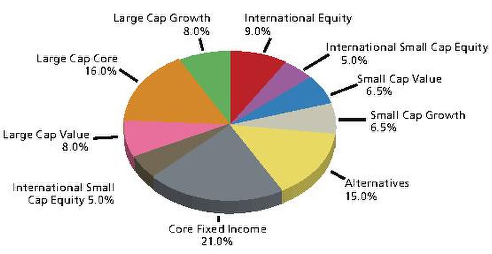

Aujourd’hui, le processus d’optimisation de portefeuille est grandement
automatisé et les investisseurs souhaitent avoir accès à des plateformes
digitales qui leur proposent des solutions personnalisées. **Notre
objectif dans ce rapport sera donc celui d’explorer différentes méthodes
d’optimisation afin de proposer à un spectre très large de clients une
*asset allocation* qui soit en adéquation avec leurs attentes.**

Analyse du portefeuille initial
===============================

Rendements
----------

Nous avons commencé par récupérer les capitalisations boursières ainsi
que la liste des prix grâce à *yfinance*. Après avoir nettoyé les
données (ce qui revient à retirer les valeurs extrêmes), nous nous
sommes intéressés à l’évolution des rendements du portefeuille.

Cette première comparaison permet d’établir une similitude entre les
rendements du portefeuille et ceux de l’indice de référence *US Equity*
:

-   Les rendements journaliers varient entre +7.5% et -12%

-   On remarque qu’il existe trois périodes durant lesquelles les
    variations de rendements sont importantes : la crise des *subprimes*
    en 2008, la crise de la dette de la zone euro en 2010 (magnitude
    plus faible car il s’agit de *US Equity*) et la crise du Covid en
    2020.

L’allure générale des rendements est cohérente mais une étude plus
approfondie grâce aux différentes mesures de risques est nécessaire. La
distribution des rendements journaliers est leptokurtique (*fat tail*
avec des valeurs extrêmes assez fréquentes), ce qui est récurrent dans
les distributions financières. Dans un premier temps, on peut approximer
cette distribution par une gaussienne centrée en 0.03 % (rendement
journalier moyen) et d’écart type (volatilité journalière) qui vaut
1.43%.

Les mesures de risque
---------------------

Un *drawdown* représente l’ampleur de la baisse maximale (c’est-à-dire
entre un maximum et un minimum locaux) dans la valorisation d’un actif
ou d’un portefeuille donné. Les deux cours ont la même allure et
présentent des *drawdowns* (*first drawdown* en rouge et *second
drawdown* en vert) de même ordre de grandeur (68.27% / 55.25% et 28.54%
/ 33.79%, respectivement pour notre portefeuille et l’indice de
référence). Le temps nécessaire pour que l’actif reprenne de la valeur
après un *drawdown* doit également être pris en compte lors de
l’évaluation de ce dernier : par exemple, la récupération du *first
drawdown* se fait sur une échelle de temps longue, car la crise des
*subprimes* a eu un grand impact sur les actifs américains.\

Par ailleurs, la figure ci-dessous permet d’affirmer que :

-   Notre portefeuille est fortement corrélé avec l’indice de référence
    (peu de points éloignés de la droite de *best fit*)

-   Le $\beta$ vaut pratiquement 1 (le portefeuille ne sous/surréagit
    pas à une variation du marché)

Il semble donc pertinent de considérer ce portefeuille comme un
portefeuille de référence pour la suite.

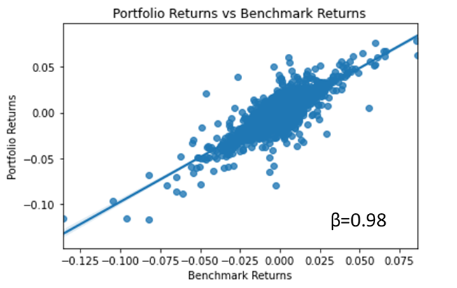

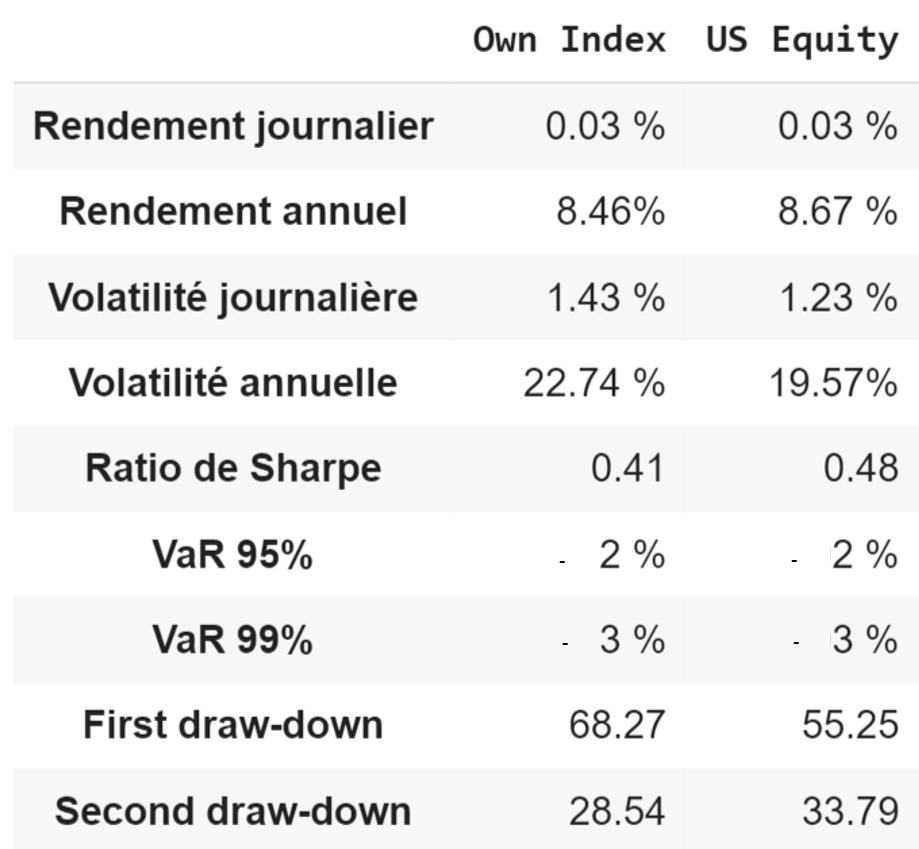

Ce tableau vient résumer l’ensemble des mesures de risque que nous avons
étudiées. La volatilité est légèrement supérieure pour le portefeuille
donné (on aurait pu éventuellement retirer 5 points extrêmes
supplémentaires, ce qui aurait légèrement baissé la volatilité). Par
ailleurs, le ratio de Sharpe est inferieur car à rendement égal nous
avons une volatilité supérieure. Par la suite ce ratio sera considéré
comme l’un des plus importants pour mesurer l’efficacité des différentes
méthodes d’optimisation.\

Les VaR sont toutefois rassurantes. Un investisseur encaissera une perte
journalière maximale inférieure à 3% (avec une confiance de 99%), ce qui
correspond à un bon ordre de grandeur. Il faut bien évidemment garder en
tête que les mesures de risque (notamment le ratio de Sharpe et la VaR)
présupposent que notre rendement suit une distribution normale, ce qui
n’est pas tout à fait le cas.

Analyse sectorielle du portefeuille
-----------------------------------

Après avoir renormalisé les capitalisations boursières (somme par
secteur égale à 1), nous avons estimé les caractéristiques de chaque
secteur.

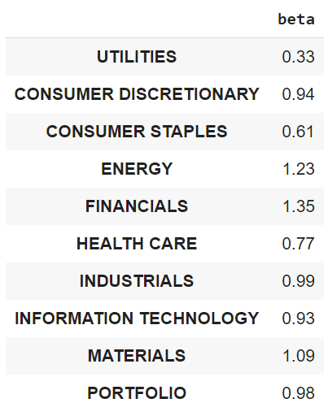

Les différentes valeurs prises par $\beta$ sont cohérentes. Le secteur
des *Utilities* et du *Healthcare* sont essentiels et réagissent donc
moins aux mouvements du marché (respectivement $\beta=0.33$ et
$\beta=0.77$). En outre, le secteur *Financials* est réputé comme étant
généralement plus volatil. Ici, une baisse de 1% du marché entrainerait
une baisse de 1.35% du secteur.\

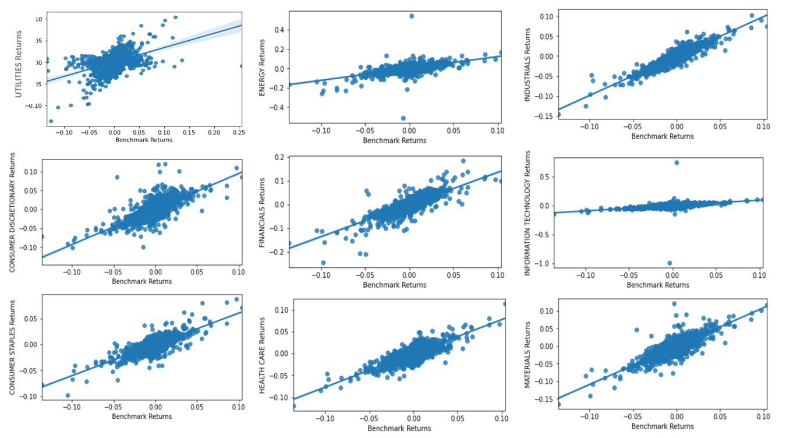

Le tableau ci-dessous permet de déterminer les secteurs les plus
performants.

-   **Secteurs performants :** *Consumer Discretionary*, *Healthcare*,
    *Industrials*

-   **Secteurs non performants :** *Energy*, *Financials*\

Le ratio de Sharpe du secteur financier est généralement proche de 0 car
c’est un secteur très volatile avec des rendements faibles (on pourrait
encore corriger cet indicateur par l’inflation). Cela étant dit, le
secteur de l’énergie semble présenter un comportement inhabituel : ceci
peut s’expliquer par un mauvais échantillonnage (choix des entreprises
peu diversifié), un mauvais nettoyage des données dans ce secteur, ou
encore une très forte baisse de la valorisation de certaines entreprises
durant la crise du Covid.

Méthodes d’optimisation
=======================

La partie précédente a montré comment représenter l’évolution et
analyser les risques d’une *asset alloction* donnée. Mais comment
calculer en pratique ces *asset allocations* ? Cela va toujours passer
par la résolution de problèmes d’optimisation, où l’on cherche à
maximiser une fonction objectif $f$ :

$$\max_{w} f(w,\mu,\Sigma)$$ où $w$, $\mu$ et $\Sigma$ sont
respectivement le vecteur des allocations, le vecteur des rendements, et
la matrice de covariance des rendements.\

Puisque nous n’avons évidemment pas accès aux rendements futurs, nous
devons les estimer : c’est l’un des enjexu majeurs de l’optimisation de
portefeuille et nous détaillons notre travail sur le sujet dans la
section 4 du rapport. De plus, ces problèmes d’optimisation doivent être
résolus en tenant compte d’un certain nombre de contraintes. On
distingue les contraintes *soft* de contraintes dites *hard* : une
contrainte *soft* se matérialise sous la forme d’un terme de
pénalisation dans la fonction objectif (par exemple
$-\lambda w^{T}\Sigma w$) alors que les contraintes *hard* sont hors de
la fonction objectif (par exemple $\max_{w} f(w,\mu,\Sigma)$, s.c.
$w^{T}\Sigma w \leq \sigma^{2})$.\

Dans la suite, nous imposerons par défaut au moins les deux contraintes
*hard* suivantes : $$w \geq  0 \text{ et } \mathbb{1}^{T}w=1$$ avec
$\mathbb{1} \in \{1\}^{dim(w)}$. La première signifie que nous
n’autorisons pas le *short* (vente à découvert) et la deuxième signifie
que nous implémentons des stratégies autofinancées (sans retrait ni
apport de capital).

Optimiseur de type MVO avec contrainte *soft*
---------------------------------------------

Les optimiseurs de type *Mean Variance Optimisation* (ci-après MVO) ont
pour objectif de maximiser le rendement tout en prenant en compte les
risques (qui s’expriment au travers de la volatilité des actifs).\

Le paramètre $\lambda$ (paramètre d’aversion au risque) permet de rendre
compte de cet effet dans la fonction objectif. Plus $\lambda$ est élevé,
plus l’optimiseur privilégiera un risque faible (au détriment d’un
rendement). La fonction objectif à maximiser devient :

$$f(w,\mu,\Sigma)=\mu^Tw - \lambda w^T\Sigma w \ \text{ s.c. } \ w \geq  0 \text{ et } \mathbb{1}^{T}w=1$$

Nous allons comparer un portefeuille autofinancé (cela signifie que nous
nous donnons 100\$ de départ et investissons l’argent à disposition
chaque mois en suivant strictement l’allocation proposée par
l’algorithme) obtenu grâce au MVO avec le portefeuille donné.

Le portefeuille obtenu propose un plus grand retour sur investissement
au prix d’un plus grand risque que le portefeuille de référence. Malgré
tout, le *trade off* semble acceptable puisque le ratio de Sharpe est
supérieur comme le montre le tableau récapitulatif suivant.

Optimiseur de type variance minimale
------------------------------------

Les optimiseurs MVO permettent en général de répondre aux attentes des
investisseurs classiques qui s’autorisent un niveau de risque moyen.
Néanmoins, certaines personnes sont très prudentes face aux fluctuations
du marché et désirent adopter des stratégies plus sûres. Ces stratégies
*risk-based* ont alors pour but de minimiser la volatilité du
portefeuille, comme l’optimisation variance minimale qui ne se fixe
aucune contrainte par rapport aux rendements attendus. Cette méthode
revient à résoudre le problème suivant :
$$\min(w^T\Sigma w) \ \text{ s.c. } \ w \geq 0, \mathbb{1}^{T}w=1$$

On observe, sur la frontière efficiente ci-dessus, que le rendement
associé à cette stratégie, de volatilité minimale, est le plus faible.

Pour comprendre les avantages de cette méthode, nous avons décidé de la
comparer à un MVO avec un coefficient d’aversion au risque élevé (de
l’ordre de plusieurs dizaines), stratégie qui pourrait également
convenir à un investisseur prudent. Comme prévu, nous remarquons que le
portefeuille proposé par la méthode de variance minimale donne lieu à un
retour sur investissement plus faible. Néanmoins, cette observation est
à mettre en parallèle avec l’allure générale des deux courbes. En effet,
la valeur du portefeuille variance minimale est moins sujette aux
fluctuations au cours du temps.\

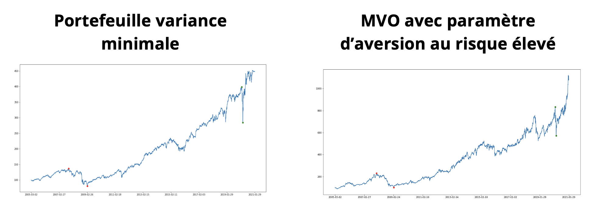  

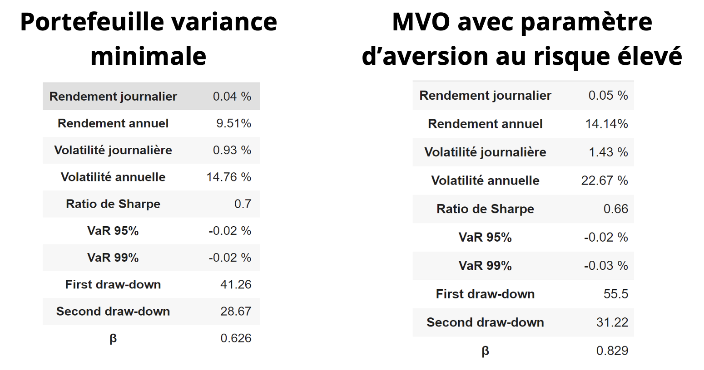  

Sur le tableau ci-dessus, nous remarquons tout d’abord que la volatilité
annuelle du MVO est plus de 2 fois supérieure à celle du portefeuille
variance minimale. S’ajoutent à cela les différences notables de
*drawdowns* avec 20% de perte en moins. Enfin, on peut également voir
que le $\beta$ est beaucoup plus faible, ce qui atteste du fait qu’elle
est moins sensible aux fluctuations de l’indice de référence.

Optimiseur de type MVO avec contrainte *hard*
---------------------------------------------

Les optimiseurs de type *Mean Variance Optimisation* dotés d’une
contrainte *hard* imposent que la condition doit obligatoirement être
vérifiée. Nous pouvons noter par exemple l’optimiseur suivant :

$$\max(\mu^{T}w) \ \text{ s.c. } \ w \geq 0, \mathbb{1}^{T}w=1 \text{ et } w^{T}\Sigma w < vol_{\max}$$

La figure suivante permet de situer graphiquement le couple $(vol,\mu)$
par rapport à la frontière efficace ; en effet, ce dernier se retrouvera
forcément à gauche de la droite verticale d’abscisse égale à
$vol_{max}$.\

Nous allons maintenant comparer les résultats des MVO avec contraintes
*soft* et *hard* (volatilité maximale fixée à 40%). Dans ce but, nous
mettons en regard la performance des portefeuilles autofinancés ainsi
que les mesures de risque.

[c].5 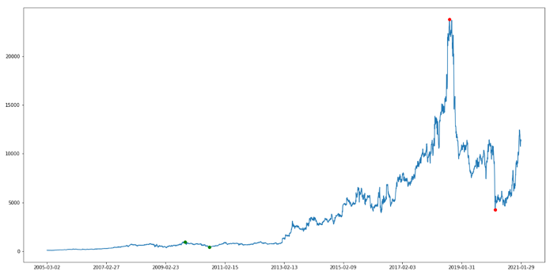

[c].5 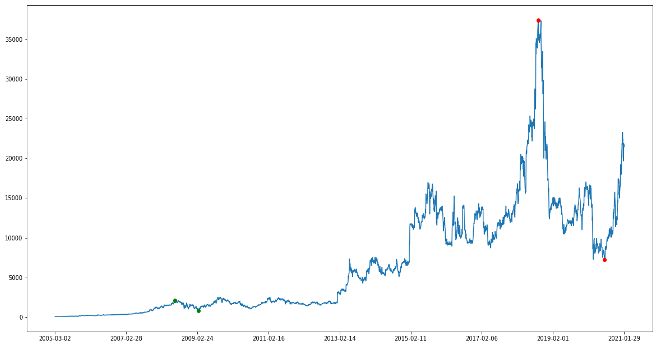

Il faut également noter que le temps de calcul pour le MVO avec
contrainte *hard* est bien supérieur à celui du MVO classique.

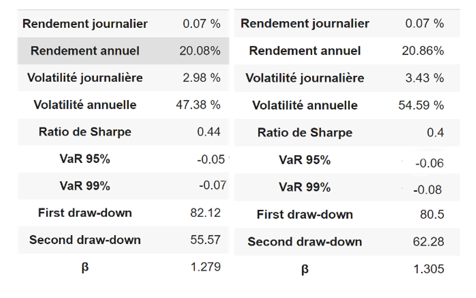  

Remarquons le fait que les rendements journaliers et annuels sont à peu
près équivalents dans les deux cas. Néanmoins, les volatilités du MVO
contrainte *hard* dépassent largement celles du MVO classique, ce qui
affecte ainsi le ratio de Sharpe. Il est intéressant de noter que bien
que la contrainte ait imposé une volatilité inférieure à 40%, notre
tableau présente une valeur de 54.59%. Cette différence peut s’expliquer
par les erreurs d’approximation de $\Sigma$, qui n’est estimée que sur
une quantité restreinte de données.

Optimisation robuste
--------------------

Généralement, les MVO sont des optimiseurs très sensibles aux données en
entrée. En d’autres termes, de petites erreurs sur $\mu$ peuvent
engendrer des allocations très différentes. On pourrait alors
s’intéresser à des méthodes plus robustes, résistant mieux à des $d\mu$.
Le principe de l’optimisation robuste est de rajouter dans la fonction
objectif du MVO un terme de pénalisation des erreurs d’estimation (ce
terme vient d’une maximisation de $(\mu - \overline{\mu})^{T}w$ dans une
ellipsoïde autour de $\Omega^{-1}$ avec $\overline{\mu}$ le rendement
théorique) :

$$\max_{w} \mu^{T}w -\lambda w^{T}\Sigma w -\kappa \sqrt{w^{T}\Omega w}$$
où $\Omega$ est la matrice de covariance des erreurs d’estimation des
rendements, et $\kappa$ l’aversion aux erreurs. On choisira par le suite
$\kappa = 0.2$.

### Comparaison entre MVO classique et optimisation robuste

Que ce soit au niveau des courbes ou des indicateurs, les deux méthodes
semblent très similaires. Le MVO classique performe ici un peu mieux
avec une volatilité légèrement plus haute. Le ratio de Sharpe est à
peine meilleur pour le MVO classique mais les autres indicateurs de
risque sont presque identiques. Pour voir de meilleurs résultats, il va
s’agir d’influer sur le paramètre fondamental $\Omega$.

[c].45
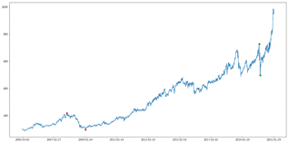

[c].45 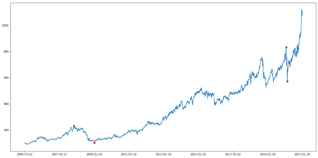

### Choix de $\Omega$

Le choix de la matrice $\Omega$ est assez primordial lorsque l’on
s’intéresse à l’optimisation robuste. Dans la littérature les choix
considérés sont souvent :

-   $\Omega = \Sigma$ : intuitivement, ce choix de $\Omega$ ne change
    pas grand chose par rapport au MVO classique, puisque le terme de
    pénalisation n’est alors que la racine de la volatilité qui était
    déjà pénalisée. À priori, la sensibilité aux erreurs ne sera pas
    effectivement réduite avec un tel choix

-   $\Omega = diag(\Sigma)$ : cette option semble meilleure puisqu’elle
    pénalise uniquement les volatilités des actifs, qui sont
    probablement à la source des erreurs

-   $\Omega = I_n$ : ce choix ne fait pas la différence entre un actif
    peu volatile et un actif très volatile. Ces dernirs étant des
    sourcse potentielles d’erreurs plus grandes, la matrice $I_n$ n’est
    probablement pas la meilleure solution.

Une autre idée que nous avons étudiée est celle consistant à construire
un estimateur $\overline{\Omega}$. Nous allons ainsi observer les
erreurs que l’on aura faites dans le passé (sur un période fixée à
quelques mois) avec notre estimateur de $\mu$ afin d’obtenir la matrice
$\Omega$ de covariance des erreurs d’estimation obtenues (les détails de
l’estimateur sont exposés dans la prochaine section). Il est possible de
faire une hypothèse supplémentaire en supposant que les erreurs ne sont
pas corrélées : cela revient à se restreindre à la diagonale.\

Dans un premier temps, nous allons comparer deux portefeuilles dont le
seul paramètre modifié est $\Omega$ (diag($\Sigma$) à gauche et
diag($\hat{\Omega}$) à droite).

[c].45 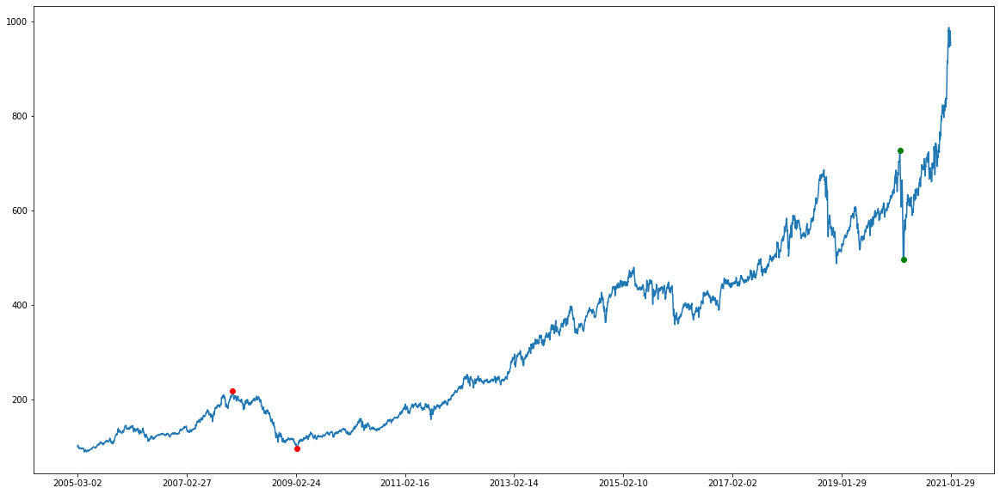

[c].45 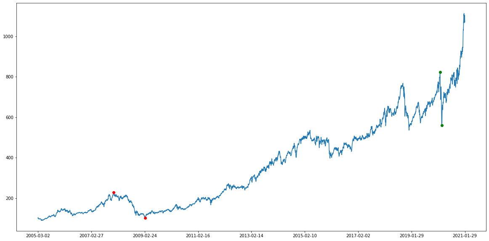

[c].5 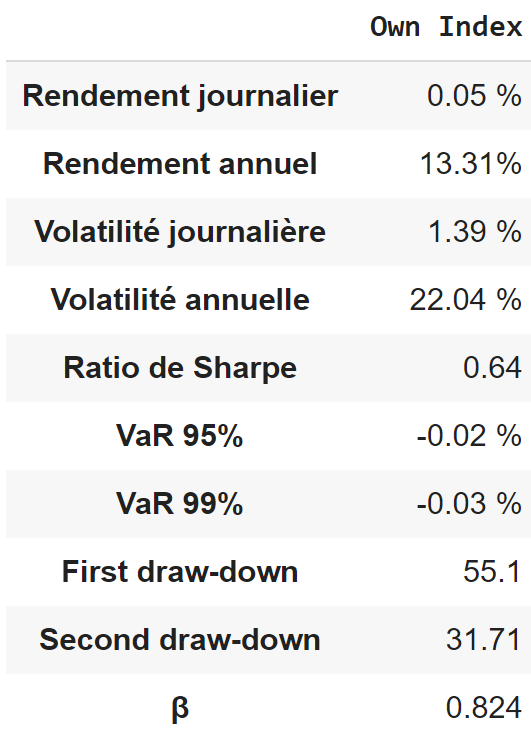

[c].5 

Ci-dessous, nous montrons une comparaison entre deux autres choix de
$\Omega$ : $\Sigma$ et $\hat{\Omega}$.

[c].5 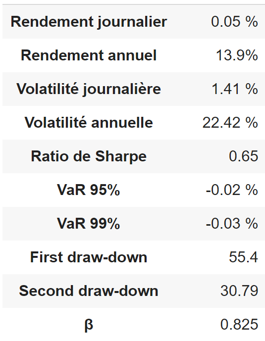

[c].5 

Estimation des propriétés futures des actifs
============================================

out au long des sections précédentes, nous avons implementé différents
modèles visant à approximer une allocation optimale d’actifs de type US
equities (qui est bien évidemment impossible à atteindre sans avoir
recours à des données *forward*). Quel que soit le modèle, il paraît
clair que disposer d’une meilleure connaissance des paramètres
traduisant les propriétés futures des actifs permet d’améliorer la
qualité de l’approximation obtenue. Dans cette section, nous nous
intéresserons ainsi à la construction de *meilleurs* estimateurs de
$\mu$, $\Sigma$ et $\Omega$ (par convention, $\mu(t)$ designera un
vecteur contenant les rendements mensuels réels des actifs alors que
$\hat{\mu}(t)$ designera un vecteur de rendements mensuels estimés).

Estimateurs empiriques basés sur la moyenne
-------------------------------------------

L’approche la plus naïve pour construire des estimateurs
$\hat{\mu}_{\mathbb{E}}$, $\hat{\Sigma}_{\mathbb{E}}$ et
$\hat{\Omega}_{\mathbb{E}}$ reste sans doute de supposer qu’une moyenne
glissante sur un certain nombre de valeurs précédentes permet de bien
anticiper la valeur future. On se rend vite compte qu’une telle
supposition implique que le cours de l’actif sous-jacent demeure
relativement stable d’un mois à l’autre, ce qui n’est pas du tout le cas
pendant une crise de forte volatilité (crise des subprimes de 2008 ou du
Covid-19 en 2020 notamment). Par ailleurs, les propriétés intrinsèques
d’une moyenne font que ces estimateurs auront tendance à réagir de
manière retardée, par exemple lorsque le prix du marché diminue
brutalement. La simplicité d’implémentation de tels estimateurs demeure
toutefois leur point fort majeur, ce qui fait que nous avons
implicitement utilisé ces derniers jusqu’ici et qu’ils serviront donc de
*benchmark* pour les estimateurs plus évolués qui seront préséntés dans
la suite de cette section ; plus précisements, les définitions que nous
avons adoptées sont :

$$\hat{\mu}_{\mathbb{E}}(t) = \frac{1}{46}\sum_{i=t-47}^{t-1} \mu(i)$$
c’est-à-dire la moyenne sur les rendements mensuels calculés jour par
jour sur les 2 derniers mois

$$\hat{\Sigma}_{\mathbb{E}}(t) = Cov((\mu(i))_{t-47 \leq i \leq t-1})$$
c’est-à-dire les covariances des rendements mensuels calculés jour par
jour sur 2 derniers mois

$$\hat{\Omega}_{\mathbb{E}}(t) = Cov((\mu(i) - \hat{\mu}(i))_{t-47 \leq i \leq t-1})$$
c’est-à-dire les covariances des erreurs sur les estimations des
rendements mensuels des 2 derniers mois

Modèles ARIMA
-------------

On remarque que la manière la plus simple d’améliorer la prédiction des
rendements consiste à prédire à court terme l’évolution du cours de
l’actif sous-jacent puisque ce dernier exhibe souvent des propriétés de
stationnarité au sens faible (quitte parfois à différencier le processus
un certain nombre de fois). On modélise alors par un processus
*auto-régressif intégré moyenne mobile*, plus simplement appelé
$ARIMA(p,d,q)$ (modélisation classique pour les séries financières
permettant d’estimer $S_{t+1}$) défini comme suit :

$$\phi(L)(1-L)^d S_t = \theta(L)\epsilon_t$$ avec $S_t$ le cours de
l’actif en fin de mois, $L$ l’opérateur de décalage arrière, $\phi(L)$
et $\theta(L)$ des polynômes de degrés $p$ et $q$ sans racines communes
et toutes de module $> 1$ et $\epsilon_t$ un bruit blanc.

Réseaux de neurones récurrents
------------------------------

Tout comme dans les modèles ARIMA, nous adoptons une démarche de
prédiction du cours du sous-jacent, permettant par la suite de calculer
un rendement mensuel prévisionnel puis d’utiliser cette estimation pour
ajouter un point dans la méthode de calcul de
$\hat{\Sigma}_{\mathbb{E}}(t)$ et $\hat{\Omega}_{\mathbb{E}}(t)$. La
différence est ici que la méthode de prédiction du cours se base sur des
réseaux de neurones récurrents (réseaux LSTM).

### Modèle LSTM

[h].6 

Inspirés par des recherches en ligne @lstm, nous avons décidé d’adopter
la structure suivante pour le réseau de neurones :

-   **Couche LSTM :** bien adaptée à la prévision sur les séries
    temporelles car il est nécessaire de bénéficier d’un effet mémoire
    (décalages temporels inconnus entre les évènements remarquables)

-   **Couche Dropout :** prévenir *l’overfitting*

-   **Couches Dense :** faire interagir les données en sortie des
    couches précédentes

-   **Couches Activation :** recadrage de l’output

.35  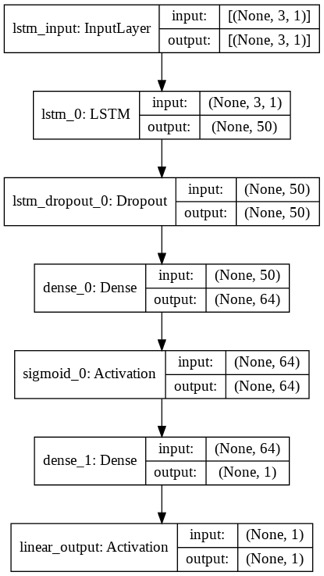

Comme on peut le lire sur le schéma synthétique ci-dessus, nous avons
fait le choix d’utiliser 3 données temporelles (c’est-à-dire le cours de
l’actif à la fin du mois actuel et des 2 mois précédents) pour prévoir
le cours de l’actif en fin du mois prochain, permettant ainsi de
calculer le rendement estimé $\hat{\mu}_{NN}(t,actif)$ ; un tel choix
résulte d’un *trade-off* entre la prise en compte de l’effet de mémoire
et une diminution du nombre de données d’entraînement. Finalement, le
modèle est entraîné à chaque itération sur 20 générations avec un
learning rate de $0.5\%$, la MSE comme fonction de *loss* et *Adam*
comme optimiseur.\

Le modèle LSTM peut se révéler extrêment performant dans un scénario
favorable (dans les graphiques ci-dessous, nous adoptons l’échelle
temporelle de la journée et utilisons 50 données pour prédire 1 point).

### Implémentation pratique

Si les résultats ci-dessus sont très convaincants, il est facile de
comprendre que le fait de *sampler* le cours par un seul point par mois,
d’avoir accès à moins de données d’entraînement (il ne faut pas utiliser
de données *forward*), surtout dans les dates aux alentours de 2005, et
de n’utiliser que 3 points précédents sont autant de simplifications
nécessaires pour une implémentation pratique mais qui vont dégrader les
résultats. Par ailleurs, la complexité étant élévée à chaque itération,
on remarque qu’un tel estimateur n’est utilisable que pour des
optimisations où l’on se limite à un faible nombre d’actifs considérés.
On propose ainsi le protocole suivant pour mettre en place cet
estimateur :

1.  On extrait les données de cours de fin de mois

2.  On entraîne le réseau LSTM décrit à la section précedente pour un
    actif donné avec l’ensemble des données mensuelles disponibles sans
    données *forward*

3.  On effectue une prévision à l’aide de 3 derniers mois de données
    possibles

4.  On obtient $\hat{\mu}_{NN}(t,actif)$ (10 secondes environ)

5.  On répète l’opération pour la totalité des actifs considérés par le
    portefeuille

### Évaluation des performances

Afin d’évaluer l’efficacité de ce nouvel estimateur, nous nous proposons
d’étudier l’évolution de la valorisation d’un portefeuille autofinancé
sur une période récente (où l’on devrait voir un plus grand intérêt du
réseau de neurones, puisqu’il aura eu l’occasion de s’entraîner sur un
plus grand *batch* de données). Dans le but de limiter la complexité
temporelle, nous ne considérons que les 2 sociétés ayant les plus
grandes capitalisations sur cette période (c’est-à-dire Apple et
Microsoft pour 2017-2018) et utilisons la même méthode d’optimisation
pour les 2 simulations (c’est-à-dire un MVO avec $\lambda = 10$).

Les graphiques ci-dessus montrent que le portefeuille disposant de
l’estimateur $\hat{\mu}_{NN}$ (à droite) performe mieux que celui
disposant de l’estimateur $\hat{\mu}_{\mathbb{E}}$ (à gauche), notamment
au cours des derniers mois où la baisse du prix des 2 actifs a été mieux
anticipée par le réseau de neurones, ce qui a permis de mieux se
prémunir contre les risques (les 2 actifs étant ici très corrélés une
baisse était inévitable).

Conclusion et ouverture
=======================

u vu des éléments préséntés dans la totalité des sections précédentes,
nous avons pu remarquer que certaines méthodes d’optimisation étaient
plus pertinentes pour une certaine classe d’acteurs. En guise de
conclusion synthétique, nous nous proposons donc d’établir un tableau
permettant d’identifier la méthode optimale en fonction du scénario
considéré ; à cela il faut ajouter la liberté offerte par le choix des
estimateurs (par exemple, $\hat{\mu}_{NN}$ si l’on considère un
portefeuille avec peu d’actifs), qui va permettre de mieux *hedger* le
portefeuille par rapport aux évolutions futures du marché.\

[!h]

   **Profils**               **Candidats**
  -------------- -------------------------------------
    Classique                 MVO robuste
     *Risky*      MVO classique avec $\lambda$ faible
   Conservateur            Variance minimale

Il est également primordial de reconnaître que notre étude n’est que
partielle et qu’il manque de nombreux éléments afin de présenter des
conclusions robustes. Par exemple, certaines pistes d’amélioration
intéressantes pourraient être :

-   Autoriser des poids négatifs, autrement dit donner la possibilité de
    *shorter* des actifs

-   Créer des optimisateurs plus robustes pour $\Omega$ et $\Sigma$, par
    exemple en se basant sur le même genre de méthodes que pour $\mu$

-   Plus fondamentalement, on remarque qu’il est impossible de descendre
    sous une volatilité critique (d’environ $14 \%$ pour les US
    equities) puisque l’on ne diversifie pas les types d’actifs présents
    dans le portefeuille. Considérer des produits financiers beaucoup
    plus sûrs (tels que les obligations ou du *cash*) ou, au contraire,
    des produits extrêmement volatiles (tels que les cryptomonnaies),
    permettrait de donner plus de liberté aux algorithmes et de mieux
    répondre aux attentes des clients

2

Y. Ahmed (2019)\
*Predicting stock prices using deep learning*\
<https://app.golinks.io/lstm>

F. Neves (2018)\
*Plotting Markowitz Efficient Frontier with Python*\
<https://app.golinks.io/plot>

Keithbob (2011)\
*Illustrating a diversified investment portfolio*\
<https://en.wikipedia.org/wiki/File:Asset_Allocation.pdf>
